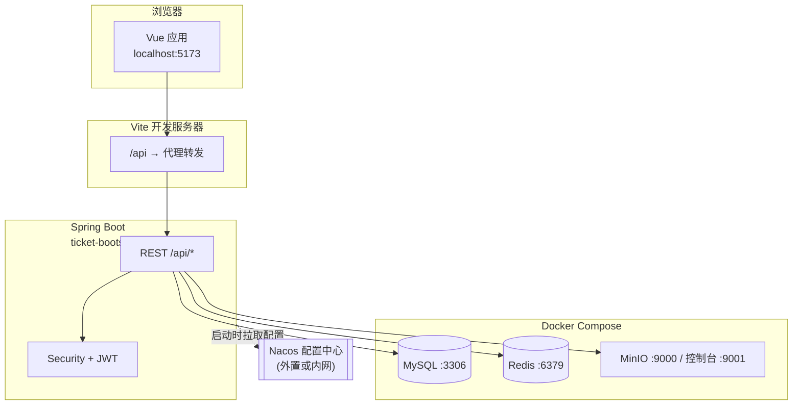
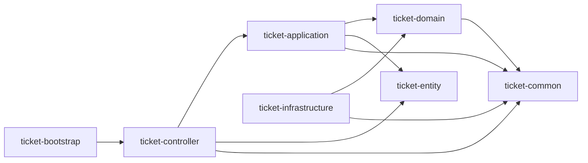
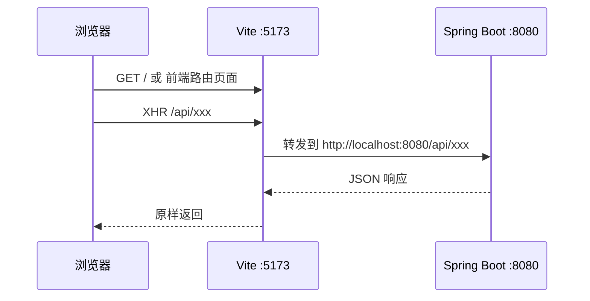

# 米多内部工单系统 — 开发者本地环境与联调操作手册

> **版本**：v1.0 | **日期**：2026-03-31 | **状态**：已落地

---

## 1. 文档标识

| 项 | 内容 |
|----|------|
| **系统名称** | 米多内部工单系统（Ticket Platform + 前端 miduo-frontend） |
| **手册版本** | 1.0 |
| **最后更新** | 2026-03-31 |
| **撰写** | DocSense |
| **读者角色** | 后端 / 前端 / 全栈**开发工程师**（负责本地起服务、改代码、联调与自检） |

**本手册覆盖**：在单机（本机）上启动依赖服务、启动后端与前端、访问 Swagger 与健康检查、理解请求链路、执行常见质量检查。  
**本手册不覆盖**：生产发布流水线、K8s 编排、企业微信正式 OAuth 全流程验收（仅说明本地相关配置入口）。

---

## 2. 概述

米多内部工单系统为**前后端分离**架构：后端为 Spring Boot 模块化单体（`ticket-platform/`），前端为 Vue 3 + Vite（`miduo-frontend/`）。开发联调时，浏览器访问前端开发服务器，由 Vite 将 `/api` 代理到本机后端；后端连接 MySQL、Redis、MinIO，并从 **Nacos** 拉取敏感配置（数据源、JWT、企微等）。

以下图示帮助你在脑中建立**组件边界**与**调用方向**（读图顺序：自上而下为依赖方向）。

### 2.1 本地运行时拓扑（逻辑视图）

**图意说明**：实线为运行时数据路径；虚线为应用启动阶段从 Nacos 注入配置。

### 2.2 后端模块依赖（仓库结构速查）

**图意说明**：开发改接口时通常接触 `ticket-controller` 与 `ticket-application`；领域规则在 `ticket-domain`；数据库实现在 `ticket-infrastructure`。

---

## 3. 前置要求

在开始下列任务前，请**逐项确认**已满足：

| # | 条件 | 验证方式 |
|---|------|----------|
| 1 | 已安装 **JDK 8**（非 JDK 11/17/21） | 终端执行 `java -version`，主版本号为 8。Linux 云环境可使用 `JAVA_HOME=/opt/jdk8`。 |
| 2 | 已安装 **Maven 3.8+** | `mvn -v` 正常输出。 |
| 3 | 已安装 **Docker** 与 **Docker Compose**，且守护进程已运行 | `docker ps` 无报错。 |
| 4 | 已安装 **Node.js**（与仓库 `miduo-frontend` 的 `package.json` 要求一致）与 **npm** | `node -v`、`npm -v` 有输出。 |
| 5 | 可访问 **Nacos**（`bootstrap.yml` 默认 `NACOS_SERVER_ADDR`，命名空间 `NACOS_NAMESPACE`） | 与团队确认地址；本地若无法访问默认地址，需改环境变量指向可达的 Nacos。 |
| 6 | Nacos 中已存在 **`ticket-platform-secrets.yml`**（或团队约定的等价 Data ID），含数据源、Redis、JWT 等 | 与运维/负责人确认；无此配置后端启动会失败。 |

> **注意**：后端**必须**使用 JDK 8 编译与运行；使用系统默认 JDK 21 将导致构建或运行失败。  
> **注意**：Docker Compose 要求已设置 `MYSQL_ROOT_PASSWORD`、`MINIO_ROOT_PASSWORD`（见 `deployment/docker/.env`），否则 `docker compose up` 会报错退出。

**假设（若与你的环境不一致请改配置后再操作）**：

- 仓库根路径为 `{REPO}`，下文命令中请自行替换为实际路径（例如 `/workspace`）。
- 后端监听 `http://localhost:8080`，前端开发服 `http://localhost:5173`。

---

## 4. 核心操作流程

### 任务一：启动基础设施（MySQL / Redis / MinIO）

1. 在终端进入 Docker Compose 目录，并确保 `.env` 已按 `deployment/docker/.env.example` 准备好。  
   **预期结果**：当前工作目录包含 `docker-compose.yml`。  
   【终端中 `cd {REPO}/ticket-platform/deployment/docker`】

2. 执行 `docker compose up -d`（若需特权环境，按你方规范使用 `sudo`）。  
   **预期结果**：命令退出码为 0；`docker ps` 可见 `ticket-mysql`、`ticket-redis`、`ticket-minio` 等容器为 Up。  
   【在 `deployment/docker` 目录执行 `docker compose up -d`】

3. 确认端口未被占用：MySQL `3306`、Redis `6379`、MinIO `9000`/`9001`。  
   **预期结果**：本机可访问 MinIO 控制台 `http://localhost:9001`（需正确账号密码，见 `.env`）。  
   【浏览器地址栏输入 `http://localhost:9001`】

> **注意**：数据库名为 `ticket_platform`（由 Compose 环境变量创建），与后端连接串需一致。  
> **提示**：首次拉镜像较慢属正常现象。

---

### 任务二：启动后端（Spring Boot，`dev` Profile）

1. 设置 `JAVA_HOME` 为 JDK 8，并将 `bin` 加入 `PATH`。  
   **预期结果**：`java -version` 显示 1.8.x。  
   【在启动后端的同一终端会话中执行 `export JAVA_HOME=...`】

2. （推荐）为七牛等 HTTPS 客户端兼容性追加 JVM 参数：`-Djdk.tls.client.protocols=TLSv1.2`。  
   **预期结果**：无单独界面；该参数写入启动命令即可。  
   【将上述参数追加在 `mvn spring-boot:run` 或 IDE Run Configuration 的 VM options】

3. 在仓库根下执行启动命令（示例与 `AGENTS.md` 一致）。  
   **预期结果**：日志出现 Spring Boot 启动完成；无 Flyway 致命错误；进程监听 `8080`。  
   【终端 `cd {REPO}/ticket-platform` 后执行：  
   `JAVA_HOME=/opt/jdk8 PATH=$JAVA_HOME/bin:$PATH mvn spring-boot:run -pl ticket-bootstrap -Dspring-boot.run.profiles=dev -Djdk.tls.client.protocols=TLSv1.2`】

4. 打开健康检查接口。  
   **预期结果**：HTTP 200，响应体表示服务存活（含组件状态时以实际 JSON 为准）。  
   【浏览器打开 `http://localhost:8080/actuator/health`】

5. 打开 Swagger UI。  
   **预期结果**：页面可加载 API 分组列表，可展开接口。  
   【浏览器打开 `http://localhost:8080/swagger-ui.html`】

> **注意**：若启动失败并提示无法连接 Nacos 或缺少配置，优先检查 `NACOS_SERVER_ADDR`、`NACOS_NAMESPACE` 与 Nacos 内 `ticket-platform-secrets.yml` 是否存在。  
> **提示**：Flyway 在应用启动时自动执行迁移脚本（V1…），无需手工跑 SQL。

---

### 任务三：启动前端并启用 API 代理联调

1. 安装依赖（首次或依赖变更后）。  
   **预期结果**：`node_modules` 生成完毕，命令退出码 0。  
   【终端 `cd {REPO}/miduo-frontend` 后执行 `npm install`】

2. 确认 `.env.development` 中 `VITE_USE_PROXY=true` 且 `VITE_API_PROXY_TARGET=http://localhost:8080`（或与你的后端地址一致）。  
   **预期结果**：文件保存后内容符合上述约定。  
   【用编辑器打开 `miduo-frontend/.env.development`】

3. 启动开发服务器。  
   **预期结果**：终端打印 Local URL，默认 `http://localhost:5173/`；无端口占用错误。  
   【在 `miduo-frontend` 目录执行 `npm run dev`】

4. 用浏览器访问前端根地址。  
   **预期结果**：工单系统前端壳加载（具体登录页形态依赖企微或开发登录配置）。  
   【浏览器地址栏输入 `http://localhost:5173/`】

> **注意**：前端请求路径为 `/api/...` 时，由 Vite 代理到后端；若直接浏览器访问 `http://localhost:5173/api/...` 行为应与代理配置一致。  
> **提示**：修改 `.env.development` 后需重启 `npm run dev`。

---

### 任务四：理解一次「页面 → 后端」的 HTTP 路径（联调心智模型）

下列示意图与你在 DevTools「网络」面板中看到的路径应对齐。

1. 打开浏览器开发者工具，切换到「网络 (Network)」面板，勾选保留日志。  
   **预期结果**：面板为空或仅有静态资源记录，准备就绪。  
   【Chrome：`F12` → Network】

2. 在前端触发任意会调用后端的操作（例如登录后打开工单列表）。  
   **预期结果**：出现以 `/api/` 开头的请求；状态码为 200 或业务约定的 4xx（需对照接口文档）。  
   【在前端界面点击会产生列表数据的菜单或按钮】

> **提示**：若请求 404 且 URL 为 `http://localhost:5173/api/...`，检查 Vite 代理是否开启、后端是否已启动。

---

### 任务五：使用 Swagger 调试认证与业务接口

1. 打开 Swagger UI（见任务二步骤 5）。  
   **预期结果**：可见「认证管理」等分组。  
   【浏览器 `http://localhost:8080/swagger-ui.html`】

2. 展开 `POST /api/auth/dev/login`（仅当 `dev-login.enabled=true` 时可用），填写请求体 `username`、`password`。  
   **预期结果**：返回体包含访问令牌字段（具体字段名以 `LoginOutput` 与 Swagger 模型为准）；HTTP 200。  
   【在 Swagger 页面点击 Try it out → 填入 JSON → Execute】

> **注意**：**生产环境禁止开启** `dev-login`；仅用于本地/测试。口令来源为 Nacos 或环境变量 `DEV_LOGIN_PASSWORD` / `DEV_LOGIN_PHONE_PASSWORD`（以实际配置为准）。  
> **提示**：企微正式登录走 `POST /api/auth/wecom/login`，本地若无企微回调与 code，可优先用 dev login 联调。

3. 将返回的 Token 按项目约定填入后续请求的 Header（如 `Authorization: Bearer <token>`），再调用业务接口（如工单相关 `/api/ticket/...`）。  
   **预期结果**：由匿名变为已认证上下文，接口返回非 401（权限不足另论）。  
   【在 Swagger 顶部 Authorize 或各请求 Header 中粘贴 Token】

---

### 任务六：执行常见质量检查（Lint / 构建）

1. 前端 Lint。  
   **预期结果**：命令退出码 0；无 ESLint 错误。  
   【终端 `cd {REPO}/miduo-frontend && npm run lint`】

2. 前端生产构建（可选，用于验证类型与打包）。  
   **预期结果**：`dist/` 生成成功。  
   【终端 `cd {REPO}/miduo-frontend && npm run build`】

3. 后端全量编译（跳过测试以节省时间，与 `AGENTS.md` 一致）。  
   **预期结果**：BUILD SUCCESS。  
   【终端 `cd {REPO}/ticket-platform && JAVA_HOME=/opt/jdk8 PATH=$JAVA_HOME/bin:$PATH mvn clean install -DskipTests`】

4. （可选）后端单元测试。  
   **预期结果**：Tests run 完成，失败数为 0。  
   【终端 `cd {REPO}/ticket-platform && JAVA_HOME=/opt/jdk8 PATH=$JAVA_HOME/bin:$PATH mvn test`】

---

## 5. 故障排查

| 现象 | 可能原因 | 检查步骤 | 恢复动作 |
|------|----------|----------|----------|
| `docker compose` 报 `MYSQL_ROOT_PASSWORD` | 未创建或未导出 `.env` | 查看 `deployment/docker/.env` 是否存在 | 复制 `.env.example` 为 `.env` 并填写强密码后重试 |
| 后端启动报 Flyway 校验失败 | 迁移脚本与库历史不一致 | 查看日志中 Flyway 版本与失败脚本名 | 按团队规范修复库或脚本；勿在生产随意 `flyway clean` |
| 后端无法连接数据库 | 容器未起、端口错、密码与 Nacos 不一致 | `docker ps`；用客户端连 `127.0.0.1:3306` | 启动 Compose；对齐 Nacos 中数据源与本地密码 |
| `SSLHandshakeException` 指向七牛上传 | JDK 8 默认 TLS 与 OkHttp 兼容性 | 查启动参数是否含 `-Djdk.tls.client.protocols=TLSv1.2` | 加上该 JVM 参数后重启后端 |
| 前端 `/api` 请求 502 或 ECONNREFUSED | 后端未监听 8080 | `curl -sS http://localhost:8080/actuator/health` | 启动 `ticket-bootstrap` |
| 前端 404 但后端正常 | 未走代理或 `VITE_API_BASE_URL` 配置错误 | 读 `.env.development` | 开发环境开启代理并指向正确 `VITE_API_PROXY_TARGET` |
| Swagger 无法调用需登录接口 | 未带 JWT | 看响应是否 401 | 先 `dev/login` 或企微登录拿 Token 再试 |
| `mvn` 编译报 JDK 版本错误 | 使用了 JDK 11+ | `mvn -v` 中 Java version | 切换 `JAVA_HOME` 到 JDK 8 |

---

## 6. 附录

### 6.1 术语表

| 术语 | 含义 |
|------|------|
| **Profile** | Spring 环境标识，`dev` / `test` / `prod` 等，决定加载哪套外部配置。 |
| **Nacos** | 配置中心；本仓库敏感项从 Nacos 注入，而非写死在提交代码中。 |
| **Flyway** | 数据库版本迁移工具；启动时自动执行 `classpath:db/migration` 下脚本。 |
| **Vite 代理** | 开发时将浏览器对 `/api` 的请求转发到后端，避免 CORS 与硬编码完整域名。 |

### 6.2 参考路径（仓库内）

| 说明 | 路径 |
|------|------|
| 后端说明 | `ticket-platform/README.md` |
| 前端说明 | `miduo-frontend/README.md` |
| Agent 速查（端口与命令） | `AGENTS.md` |
| Nacos 与 Data ID 规则 | `miduo-md/nacos-config/README.md` |
| Docker Compose | `ticket-platform/deployment/docker/docker-compose.yml` |

### 6.3 关键默认端口一览

| 服务 | 端口 |
|------|------|
| 前端 Vite | 5173 |
| 后端 HTTP | 8080 |
| MySQL | 3306 |
| Redis | 6379 |
| MinIO API / 控制台 | 9000 / 9001 |

---

**文档结束**
