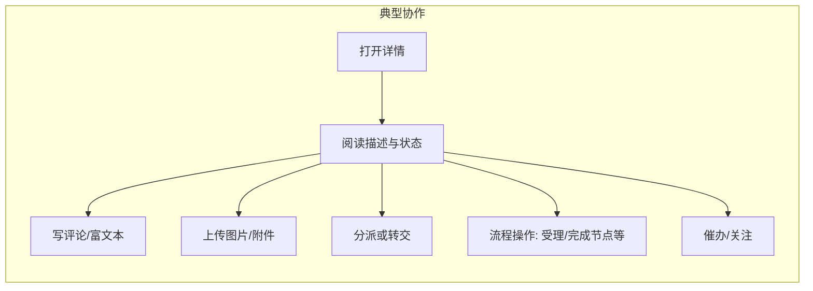

# 米多工单平台 — 普通用户操作手册

> **版本**：v1.0 | **日期**：2026-03-31 | **状态**：已落地

---

## 1. 文档标识

| 项 | 内容 |
|----|------|
| **系统名称** | 米多工单平台（米多内部工单系统 Web 端） |
| **手册版本** | 1.0 |
| **最后更新** | 2026-03-31 |
| **撰写** | DocSense |
| **读者角色** | **普通用户**（需要提交工单、查看进度、接收通知、参与协作的同事；不要求具备开发或运维能力） |

**本手册覆盖**：登录、主界面说明、搜索与新建工单、列表与看板、工单详情中的常用操作、通知、通过链接查看工单。  
**本手册不覆盖**：服务器部署、接口调试、管理后台中的分类/工作流/SLA 等配置细节（仅作入口说明）；企业微信侧具体审批策略以贵司制度为准。

**访问地址**：请向 IT 或项目负责人索取正式环境网址（形如 `https://……`）。下文用 **`{平台地址}`** 表示该地址。

---

## 2. 概述

米多工单平台用于统一接收、分派与跟踪内部问题与需求。您通过浏览器登录后，可在**仪表盘**查看概况，在**我的工单 / 所有工单**中筛选与打开工单，在**工单详情**中补充描述、沟通进展并推动状态流转（具体可点按钮以系统显示为准）。

### 2.1 登录方式总览

```mermaid
flowchart TD
  A[打开 {平台地址}] --> B{是否启用 SSO?}
  B -->|是 且 非调试| C[自动跳转米多星球]
  C --> D[在工作台进入工单入口]
  D --> E[回到工单平台 已登录]
  B -->|否 或 调试模式| F[显示账号密码登录]
  F --> G[输入用户名密码后点 登录]
  G --> E
```

**图意说明**：多数正式环境使用**米多星球 SSO**；仅在未接入 SSO 或明确开启调试入口时，才会出现页面内的账号密码表单。

### 2.2 登录后主界面结构（桌面端）

```text
+------------------------------------------------------------------+
|  [=]  当前页面标题          [搜索框........] [新建工单] (铃) 用户▼ |
+------------------+-----------------------------------------------+
| 米多工单系统      |                                               |
| · 仪表盘          |                                               |
| · 我的工单        |            主内容区（列表/表单/详情）           |
| · 所有工单        |                                               |
| · 工单看板        |                                               |
| · 报表中心        |                                               |
| · Bug简报 ▼       |                                               |
| · 通知中心        |                                               |
| · 管理 ▼          |                                               |
+------------------+-----------------------------------------------+
```

**图意说明**：左侧为功能菜单；顶部右侧为**全局工单搜索**、**新建工单**、**通知**与**个人菜单**。窄屏下左侧菜单会收进抽屉，通过左上角 **[=]** 打开。

---

## 3. 前置要求

| # | 条件 | 说明 |
|---|------|------|
| 1 | 已开通访问权限 | 由管理员在「组织账号管理」中维护；无账号则无法登录。 |
| 2 | 推荐使用现代浏览器 | 建议使用 Chrome、Edge、Safari 最新稳定版。 |
| 3 | 网络可达 `{平台地址}` | 内网或 VPN 策略以贵司为准。 |
| 4 | SSO 环境 | 若启用 SSO，需具备**米多星球**账号并从工作台进入；勿在不可信设备保存密码。 |

> **注意**：若登录页提示「账号密码登录已停用」，请勿反复尝试密码，应改从**米多星球工作台**进入工单入口。  
> **提示**：仅当运维提供「调试地址」且 URL 带 `?test=test` 时，才可能在 SSO 开启时看到账号密码框；个人用户一般无需使用。

---

## 4. 核心操作流程

### 任务一：登录系统

1. 在浏览器地址栏输入负责人提供的 **`{平台地址}`** 并回车。  
   **预期结果**：出现标题为「米多工单平台」的登录页，或短暂显示「正在跳转至米多星球登录…」。  
   【地址栏输入网址后按 Enter】

2. **若已启用 SSO 且未使用调试参数**：等待自动跳转，在米多星球完成登录后，从**工作台**进入工单快捷入口。  
   **预期结果**：浏览器回到工单平台，顶部右侧显示您的姓名或头像，默认进入**仪表盘**。  
   【在米多星球工作台点击工单/相关应用入口】

3. **若页面显示用户名、密码输入框**：输入管理员分配的账号与密码，点击蓝色 **「登录」** 按钮（或在密码框按回车）。  
   **预期结果**：页面提示「登录成功」并进入系统；失败时提示「登录失败，请检查账号或密码」。  
   【在登录卡片中填写「用户名」「密码」，点击「登录」】

> **注意**：连续输错密码可能触发贵司统一账号策略锁定，请联系管理员解锁。  
> **提示**：登录后若需离开工位，请点击右上角头像区域，在菜单中选择 **「退出登录」**。

---

### 任务二：熟悉主导航与退出

1. 查看浏览器窗口**左侧**竖向菜单。  
   **预期结果**：可见「仪表盘」「我的工单」「所有工单」「工单看板」「报表中心」「Bug简报」「通知中心」「管理」等项；带 **▼** 的条目点击可展开子菜单。  
   【点击左侧「我的工单」字样或图标】

2. 查看**顶部栏**右侧。  
   **预期结果**：可见蓝色 **「新建工单」**、铃铛图标（通知）、头像与用户名。  
   【目光移至页面最顶行右侧】

3. （可选）点击头像旁区域，选择 **「退出登录」**。  
   **预期结果**：回到登录页或 SSO 退出流程。  
   【顶部右侧头像下拉 → 「退出登录」】

> **提示**：侧栏中的 **「管理」**（分类、工作流、SLA、组织账号、系统设置、工单日志、日报管理等）通常由**管理员**使用。若您无相应职责，可忽略；若误点后出现权限不足提示，属正常现象。

---

### 任务三：使用顶部搜索查找工单

1. 确认当前为**桌面宽度**（顶部可见搜索框；手机窄屏可能无此框，请从「所有工单」进入后使用列表筛选）。  
   **预期结果**：顶部存在占位符为「搜索工单编号/标题，回车查询」的输入框。  
   【在主界面顶部找到搜索输入框】

2. 输入工单**编号或标题关键词**，按键盘 **Enter**。  
   **预期结果**：进入「所有工单」列表，且结果与关键词相关；清空搜索框并回车可回到全部列表逻辑（以页面展示为准）。  
   【在搜索框输入内容后按 Enter】

> **提示**：搜索为全局入口，适合已知编号或标题片段时快速定位。

---

### 任务四：新建工单

1. 点击顶部蓝色 **「新建工单」** 按钮。  
   **预期结果**：进入「新建工单」页面，表单分区为「基本信息」「分派与时间」「问题详情」等。  
   【顶部右侧点击「新建工单」】

2. 填写 **工单标题**（必填）。  
   **预期结果**：标题框内显示您输入的文字，字数不超过上限提示。  
   【在「工单标题」输入框填写简明问题摘要】

3. 在 **工单分类** 中选择与问题最匹配的类目。  
   **预期结果**：分类树或下拉中显示可选节点；选中后分类字段有值。  
   【点击「工单分类」控件，在树形选择器中点选一项】

4. （可选）选择 **工单模板**。  
   **预期结果**：选择分类后，「工单模板」下拉可能出现可选模板；选中后下方出现 **「模板字段」** 区域。  
   【在「工单模板」下拉中选择模板；若无模板可跳过】

5. 选择 **优先级**（必填）：紧急 / 高 / 中 / 低。  
   **预期结果**：单选项之一处于选中状态。  
   【在「优先级」单选组中点选一项】

6. （可选）选择 **处理人**、**期望完成时间**、**工单来源**。  
   **预期结果**：处理人下拉显示姓名列表；日期控件可选时间点；来源为 Web / 企业微信 / 邮件 / 电话 等之一。  
   【按需填写「处理人」「期望完成时间」「工单来源」】

7. 在 **问题描述** 中补充现象、复现步骤、截图说明等。  
   **预期结果**：文本框内保存您输入的内容。  
   【在「问题描述」多行文本框中输入】

8. 若存在 **模板字段**，逐项填写；标有必填的项不能为空。  
   **预期结果**：每个模板字段均有对应输入或下拉。  
   【在「模板字段」区域完成必填项】

9. 点击 **「提交工单」**。  
   **预期结果**：提示「工单创建成功」并自动打开该工单的**详情页**；若信息不完整，页面顶部提示例如「请先完善标题、分类和优先级」或「请填写必填字段：xxx」。  
   【表单底部点击蓝色「提交工单」】

> **注意**：提交前请确认分类与优先级正确，错误分类可能导致分派延迟。  
> **提示**：若需放弃填写，可点击 **「取消」** 返回「我的工单」列表。

---

### 任务五：在「我的工单」中查看本人相关工单

1. 在左侧菜单点击 **「我的工单」**。  
   **预期结果**：主区域显示工单表格与分页；数据与当前登录用户相关。  
   【左侧菜单点击「我的工单」】

2. 使用表头筛选、排序或分页（以页面实际列与按钮为准）。  
   **预期结果**：列表随筛选变化；底部分页显示「共 x 条」及页码。  
   【点击列筛选或底部分页控件】

3. 点击某一行的 **标题** 或操作区 **进入详情**（文案以界面为准）。  
   **预期结果**：进入该工单的详情页，可查看状态、处理人、历史记录等。  
   【在列表中点击目标工单标题】

---

### 任务六：在「所有工单」中查看与协作

1. 点击左侧 **「所有工单」**。  
   **预期结果**：显示权限范围内可见的工单列表（具体范围由后台权限决定）。  
   【左侧菜单点击「所有工单」】

2. 与「我的工单」相同，使用列表、筛选与分页查找目标工单。  
   **预期结果**：定位到目标记录并可打开详情。  
   【在表格中操作筛选与打开详情】

> **注意**：若您看不到他人工单，属于权限限制，需联系管理员调整可见范围，而非系统故障。

---

### 任务七：使用工单看板（拖拽更新状态）

1. 点击左侧 **「工单看板」**。  
   **预期结果**：主区域以多列形式展示不同状态下的工单卡片。  
   【左侧菜单点击「工单看板」】

2. 将某一工单卡片**按住**并**拖到**另一状态列上方释放。  
   **预期结果**：成功时提示「状态更新成功」，看板刷新；失败时提示错误原因（如无权限或工作流不允许）。  
   【鼠标拖拽卡片至目标列】

3. （可选）在卡片上使用打开详情的操作（若界面提供）。  
   **预期结果**：在新标签页或当前页打开工单详情（以实际按钮为准）。  
   【点击卡片上的链接或按钮】

> **注意**：并非所有状态之间都允许拖拽变更，以系统校验结果为准。  
> **提示**：若浏览器拦截弹窗，新标签打开可能失败，请允许本站弹窗后重试。

---

### 任务八：在工单详情中沟通与推进（常用能力）

工单详情页因类型与工作流不同，按钮会有差异。下列为常见能力，**若您的界面无对应按钮，说明当前状态不允许该操作**。



**图意说明**：您在详情页的主要价值是**补充信息**与**配合流程节点**；具体可点项以页面为准。

1. 在详情页阅读标题、状态、处理人、描述与时间线。  
   **预期结果**：信息加载完整；加载失败时会提示错误。  
   【进入工单详情后滚动浏览主区域】

2. 找到评论或协作输入区域，输入内容并发送（按钮名称可能为「发表评论」「提交」等）。  
   **预期结果**：新评论出现在时间线或评论列表中。  
   【在评论框输入文字后点击发送类按钮】

3. 若存在 **流程操作** 按钮（如流转、关闭、认领等），在弹出框中填写必填项后确认。  
   **预期结果**：工单状态更新，历史记录增加一条；失败时页面提示原因。  
   【点击流程类按钮 → 在对话框中确认】

4. 若工作分配变化，使用 **分派/转交** 类功能（若显示）选择新的处理人并保存。  
   **预期结果**：处理人字段更新为所选同事。  
   【在分派对话框中选择用户并确认】

> **注意**：不要在详情中填写密码、身份证等敏感隐私；描述问题尽量客观、可复现。  
> **提示**：Bug 类工单可能包含客户/开发/测试信息分区与变更历史，请只修改您职责范围内的字段。

---

### 任务九：查看通知与进入通知中心

1. 点击顶部 **铃铛** 图标。  
   **预期结果**：右侧滑出「通知消息」抽屉，列出近期通知；顶部标签显示「实时推送中」或「轮询兜底中」。  
   【点击顶部栏铃铛】

2. 点击某条通知的 **「查看」**。  
   **预期结果**：若关联工单或简报，跳转到对应详情页；否则进入通知相关页面。  
   【在抽屉内点击「查看」】

3. 点击 **「进入通知中心」** 或左侧菜单 **「通知中心」**。  
   **预期结果**：进入完整通知列表，可按类型、已读未读、时间筛选（以页面控件为准）。  
   【抽屉底部或侧栏点击「通知中心」】

4. （可选）在通知中心将单条标为已读或调整订阅偏好（若页面提供）。  
   **预期结果**：列表状态更新或提示保存成功。  
   【点击「标记已读」或保存偏好设置】

---

### 任务十：查看报表中心与 Bug 简报（按需）

1. 点击左侧 **「报表中心」**。  
   **预期结果**：进入报表页面，展示图表或表格（内容由管理员配置的数据决定）。  
   【左侧菜单点击「报表中心」】

2. 展开 **「Bug简报」**，进入 **「简报列表」** 或 **「统计看板」**。  
   **预期结果**：列表或统计视图加载；可打开某条简报详情或编辑（权限允许时）。  
   【侧栏 Bug简报 → 简报列表 / 统计看板】

> **提示**：若贵司未启用简报流程，列表可能为空；报表指标含义请咨询管理员。

---

### 任务十一：通过分享链接打开工单（免登录只读场景）

当同事提供 **公开工单链接** 时，您可能无需登录即可查看有限信息（以贵司配置为准）。

1. 点击或复制浏览器打开形如 **`{平台地址}/open/ticket/工单编号`** 的链接。  
   **预期结果**：打开只读工单详情页；若链接无效或已失效，显示错误提示。  
   【在浏览器地址栏粘贴完整链接并访问】

> **注意**：公开链接请勿转发给公司外部人员，除非经合规审批。  
> **提示**：若打开后要求登录，说明该工单未开放匿名访问，请使用本人账号登录后再试。

---

## 5. 故障排查

| 现象 | 可能原因 | 建议您执行的操作 |
|------|----------|------------------|
| 打开地址白屏或一直加载 | 网络、VPN、服务维护 | 检查网络；换浏览器；联系 IT 确认服务状态 |
| SSO 循环跳转 | 浏览器拦截 Cookie、时钟不准 | 允许第三方 Cookie；校准系统时间；清除本站 Cookie 后重试 |
| 登录失败 | 账号锁定、密码错误、未开通 | 核对账号；联系管理员重置或开通 |
| 登录后菜单空白 | 权限未配置 | 联系管理员检查账号角色与菜单权限 |
| 提交工单提示缺字段 | 未选分类/优先级或模板必填未填 | 按页面红色或提示文案补齐后再提交 |
| 看板拖拽无效 | 无权限或工作流不允许该变迁 | 改用详情页内流程操作或联系处理人 |
| 通知收不到 | 关闭了偏好、非推送时间 | 进入通知中心检查偏好；确认未屏蔽浏览器通知（若启用） |
| 搜索无结果 | 关键词不准、无权限看该单 | 换编号全文搜索；确认工单是否在可见范围内 |

---

## 6. 附录

### 6.1 术语表

| 术语 | 含义 |
|------|------|
| **工单** | 一条可跟踪的问题或需求记录，有唯一标识与状态。 |
| **SSO** | 单点登录；登录米多星球后无需再次输入工单平台密码。 |
| **工作流** | 工单从提交到关闭所经过的状态与审批规则，由管理员配置。 |
| **SLA** | 服务时效约定；超期可能触发预警或升级（以贵司规则为准）。 |

### 6.2 新建工单字段与优先级对照

| 表单字段 | 是否必填（默认规则） | 说明 |
|----------|----------------------|------|
| 工单标题 | 必填 | 一句话说清问题 |
| 工单分类 | 必填 | 影响分派与模板 |
| 工单模板 | 可选 | 选中后出现模板字段 |
| 优先级 | 必填 | 紧急 / 高 / 中 / 低 |
| 处理人 | 可选 | 不选则可能由规则分派 |
| 期望完成时间 | 可选 | 您的预期，非承诺时间 |
| 工单来源 | 可选 | 默认 Web 等 |
| 问题描述 | 可选 | 强烈建议填写利于处理 |
| 模板字段 | 按模板标 * | 必填项以页面为准 |

### 6.3 侧栏菜单速查（名称以界面为准）

| 菜单 | 普通用户典型用途 |
|------|------------------|
| 仪表盘 | 看个人或团队概况 |
| 我的工单 | 跟进自己相关的单 |
| 所有工单 | 在权限内查全部可见单 |
| 工单看板 | 按状态看板拖拽（有权限时） |
| 报表中心 | 查看统计报表 |
| Bug简报 | 简报列表与统计 |
| 通知中心 | 集中处理消息 |
| 管理 | 一般为管理员使用 |

---

**文档结束**
