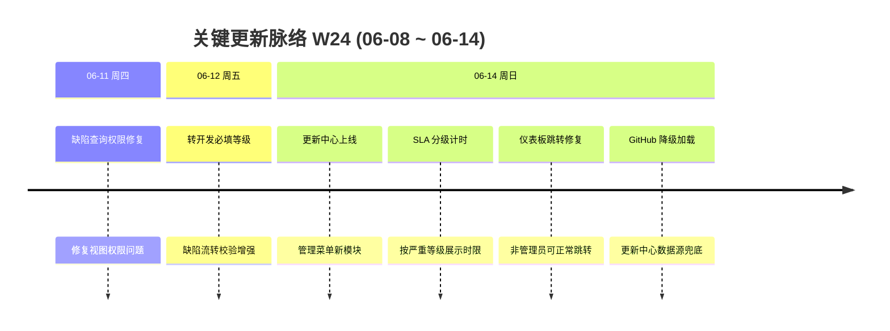

# 周报 2026-W24 (2026-06-08 ~ 2026-06-14)

> **总计 9 次提交 | 37 个文件变更 | +3643 行 / -35 行 | 7 个 PR 活跃 (#184 ~ #192)**
>
> **贡献者**：chenjiaying-miduo (7 commits), Cursor Agent (2 commits)

**本周趋势**：本周交付集中在「更新中心」新模块上线与缺陷 SLA/流转能力增强两条主线，周四至周五先落地权限与校验类修补，周日集中合并更新中心及 SLA 分级计时等大功能。

---

## 关键更新脉络

---

## 一、已合并 Pull Requests (#184 ~ #192)

| PR | 标题 | 分类 |
|----|------|------|
| #184 | 修复缺陷查询视图权限问题 | 🐛 Bug 修复 |
| #185 | 缺陷转开发时强制填写严重等级 | 🔄 更新 |
| #187 | 修复非管理员仪表板卡片跳转异常 | 🐛 Bug 修复 |
| #188 | 按缺陷严重等级调整解决 SLA 计时 | ✨ 新功能 |
| #190 | 新增工单更新中心模块 | ✨ 新功能 |
| #191 | 修复更新中心数据目录定位（脱离 git 元数据） | 🐛 Bug 修复 |
| #192 | 更新中心支持 GitHub 数据源降级加载 | 🐛 Bug 修复 |

> 注：#186、#189 等编号本周无新提交活动，未列入上表。

---

## 二、本周完成

### 1. 更新中心（Update Center）— 管理菜单全新模块上线

> **价值**：产品和开发可以在系统内集中查看版本更新记录与变更说明，不必再去翻仓库或外部文档。

- 后端：`UpdateCenterController` + `UpdateCenterApplicationService`，支持多数据源读取
- 前端：`UpdateCenterView.vue` 完整页面，含 Pinia store 与 API 封装
- 文档：设计方案、API 接口设计（含接口编号登记）、changelog 条目
- 后续修补（#191、#192）：
  - 将数据目录定位到 git 元数据之外，避免部署环境路径问题
  - 增加 GitHub 数据源降级，主数据源不可用时仍可加载更新记录

### 2. 缺陷 SLA 按严重等级计时 — 公开页展示分级解决时限

> **价值**：客户和内部同事在公开工单页能一眼看到「P0 多久必须解决」，减少反复追问进度。

- 后端新增 `SlaTimerService` 与 `DefectSeverityResolveSlaRule` 枚举，按 P0/P1/P2 分级计时
- 前端 `TicketPublicView.vue` 展示分级 SLA 信息与剩余时间
- 同步更新 PRD、测试用例、SLA 计时说明文档

### 3. 缺陷流转校验增强 — 转开发必填严重等级

> **价值**：缺陷进入开发环节前必须标明严重程度，避免「不知道有多急」就开工。

- 后端 `TransitInput` 与 `TicketWorkflowAppService` 增加严重等级校验
- 前端工单详情页与缺陷编辑页联动展示、拦截未填等级的流转操作
- 更新受理与分派流程文档、接口设计文档

### 4. 权限与仪表板体验修复

> **价值**：普通用户不再因权限或跳转逻辑问题卡在空白页，日常查看工单更顺畅。

- #184：修复缺陷查询视图权限，普通用户可正常查看授权范围内的缺陷
- #187：修复非管理员点击仪表板概览卡片时的跳转逻辑

### 5. 配套文档与测试沉淀

> **价值**：新功能有文档和测试用例可依，后续验收和交接成本更低。

- readme 补充更新中心、SLA、权限修复等使用说明与常见问题
- 功能接口对应关系、测试用例文档同步更新

---

## 三、本周数据

### 每日提交分布

| 日期 | 提交数 | 重点方向 |
|------|--------|----------|
| 06-11 (周四) | 1 | 缺陷查询视图权限修复 (#184) |
| 06-12 (周五) | 1 | 缺陷转开发必填严重等级 (#185) |
| 06-14 (周日) | 7 | 更新中心上线、SLA 分级计时、仪表板修复、GitHub 降级 (#187–#192) |

### 提交类型分布

| 类型 | 数量 | 占比 |
|------|------|------|
| feat (新功能) | 3 | 33% |
| fix (Bug 修复) | 4 | 44% |
| merge (合并提交) | 2 | 22% |

---

## 四、与上周 (W23) 对比

> 上周周报（`doc/report.2026-W23.md`）尚未生成，暂无法做指标与方向落地对比。本周为首次周报基线。

| 指标 | W23 | W24 | 变化 |
|------|-----|-----|------|
| 提交数 | — | 9 | 基线 |
| 合并 PR 数 | — | 7 | 基线 |
| 文件变更 | — | 37 | 基线 |
| 净增行数 | — | +3608 | 基线 |

---

## 五、下周优先级建议

| 优先级 | 方向 | 建议动作 |
|--------|------|----------|
| P0 | 更新中心稳定性 | 在 dev/staging 环境验证多数据源切换与 GitHub 降级路径，补齐边界场景测试 |
| P1 | SLA 分级计时验收 | 按 P0/P1/P2 各造一条缺陷工单，核对公开页展示与后端计时是否一致 |
| P2 | 缺陷流转体验 | 收集「转开发必填等级」上线后反馈，评估是否需前端引导文案或默认值策略 |
