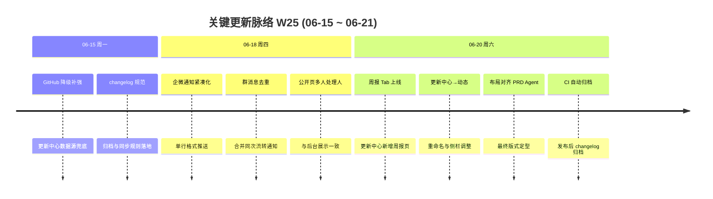

# 周报 2026-W25 (2026-06-15 ~ 2026-06-21)

> **总计 19 次提交 | 39 个文件变更 | +1988 行 / -338 行 | 19 个 PR 活跃 (#193 ~ #211)，其中 16 个已合入 main**
>
> **贡献者**：chenjiaying-miduo (13 commits), github-actions[bot] (4 commits), Cursor Agent (2 commits)

**本周趋势**：本周主线从 W24 的「更新中心上线」转向「动态页面」大改版与企微通知体验优化。周六单日集中交付 9 个 PR，经历三栏布局尝试→回滚→重命名→对齐 PRD Agent 布局的完整迭代；SLA 公开页增强（#198–#202）已开发但尚未合入 main。

---

## 关键更新脉络

---

## 一、本周完成

### 1. 更新中心演进为「动态」页面 — 周六集中迭代，完成重命名与布局定型

> **价值**：产品和开发可以在一个统一的「动态」页面查看版本更新、周报和变更记录，界面风格与 PRD Agent 保持一致，查找信息更顺手。

- 后端：`UpdateCenterApplicationService` 扩展周报数据读取，新增 API 接口（#205）
- 前端：`UpdateCenterView.vue` 多轮重构
  - 新增周报 Tab，支持按周浏览项目周报（#205）
  - 侧栏菜单位置下移至管理区下方（#206）
  - 三栏 Tab 布局尝试（#207）→ 回滚恢复（#209）→ 重命名为「动态」（#210）→ 对齐 PRD Agent 双栏布局（#211）
- 数据源：GitHub Contents API 降级加载补强（#195）
- 发布配套：changelog 归档规范（#196、#197）、CI 自动归档流水线（#204）
- 质量保障：#208 确保仅测试环境的变更不会误带入生产

### 2. 企微工单通知紧凑化与去重 — 群消息更简洁、不重复

> **价值**：同事在企微群里收到工单通知时，一眼就能看到关键信息，不会被冗长排版或重复消息刷屏。

- #200：Webhook 与企微群推送统一为单行紧凑格式 `【工单编号】【状态】【标题】详情链接`
- #201：合并同次流转的群通知；去除 Webhook/群绑定重复推送；评论@提醒同步改为紧凑格式
- 涉及 `WebhookDispatchService`、`WecomGroupPushService` 两条推送通道

### 3. MCP 只读服务（WorkBuddy 集成 P0）— AI 助手可安全读取工单数据

> **价值**：开发同事通过 WorkBuddy 等 AI 工具查询工单时，有了一套安全的只读接口，不会误改数据。

- 后端：只读 MCP JSON-RPC 服务（`feat(mcp): add read-only MCP JSON-RPC server`）
- 前端：API 密钥页支持一键复制完整 MCP 配置
- 文档：OpenSpec 提案、开发测试 MCP 技能包、接口编号 API000521

### 4. 公开工单页处理人展示修复 — 多人处理人与后台一致

> **价值**：客户在公开页看到的处理人名单和内部后台一致，不会出现「后台明明有两个人、公开页只显示一个」的困惑。

- 后端 `TicketApplicationService` 从 `ticket_assignee` 关联表汇总全部活跃处理人
- 以顿号拼接返回 `assigneeName`，替代原先只读 `ticket.assigneeId` 首位的方式

### 5. SLA 公开页增强（已开发，待合入）

> **价值**：工单解决后，客户能看到实际花了多久；未完成的才显示倒计时，时区计算也更准确。

- #198：公开页展示已完成 SLA 的实际耗时
- #199：已完成的工单隐藏 SLA 截止时间
- #202：SLA 截止时间在业务时区（而非 UTC）计算
- 以上 3 个 PR 已在分支开发完成，尚未合入 main

### 6. 文档与发布流程沉淀

> **价值**：周报有固定归档位置，changelog 发布后有自动化归档，减少手工维护成本。

- W24 周报落盘并同步文档索引（#194）
- CD 流水线增加生产发布后自动归档 changelog 步骤（#204）
- readme 与设计方案持续更新

---

## 二、下周优先级建议

| 优先级 | 方向 | 建议动作 |
|--------|------|----------|
| P0 | SLA 公开页合入与验收 | 合并 #198、#199、#202，按 P0/P1/P2 各造一条已完成/进行中缺陷，核对公开页耗时、截止隐藏与时区 |
| P1 | 「动态」页面稳定性 | 在 dev/staging 验证周报 Tab、GitHub 降级、布局对齐 PRD Agent 三条路径；关注 #207→#209 回滚后是否有残留问题 |
| P2 | MCP WorkBuddy 集成 | 在测试环境用 WorkBuddy 走通只读 MCP 查询流程，验证 API 密钥一键复制配置可用性 |

---

## 附录

### 附录 A：Pull Requests 清单 (#193 ~ #211)

| PR | 标题 | 分类 | 状态 |
|----|------|------|------|
| #193 | 新增 MCP 只读 JSON-RPC 服务（WorkBuddy 集成 P0） | 🧠 AI 能力 | ✅ 已合入 |
| #194 | 新增 W24 周报并同步文档索引 | 📝 文档 | ✅ 已合入 |
| #195 | 更新中心 GitHub Contents API 降级加载 | 🐛 Bug 修复 | ✅ 已合入 |
| #196 | 归档已发布更新中心 changelog | 📝 文档 | ✅ 已合入 |
| #197 | 补充更新中心 changelog 同步规范 | 📝 文档 | ✅ 已合入 |
| #198 | 公开页展示已完成 SLA 耗时 | ✨ 新功能 | ⏳ 未合入 |
| #199 | 公开页隐藏已完成的 SLA 截止时间 | 🐛 Bug 修复 | ⏳ 未合入 |
| #200 | 企微工单事件通知改为紧凑单行格式 | ⚡ 性能 | ✅ 已合入 |
| #201 | 企微紧凑通知 + 群消息去重 | ⚡ 性能 | ✅ 已合入 |
| #202 | SLA 截止时间在业务时区计算 | 🐛 Bug 修复 | ⏳ 未合入 |
| #203 | 公开页处理人展示与后台一致，支持多人 | 🐛 Bug 修复 | ✅ 已合入 |
| #204 | CI 生产发布后自动归档 changelog | 🔧 DevOps | ✅ 已合入 |
| #205 | 更新中心新增周报 Tab | ✨ 新功能 | ✅ 已合入 |
| #206 | 更新中心菜单移至管理区下方 | 🔄 更新 | ✅ 已合入 |
| #207 | 更新中心三栏 Tab 布局重构 | 🏗️ 架构 | ✅ 已合入（后被 #209 回滚） |
| #208 | 保留仅测试环境的更新中心变更 | 🐛 Bug 修复 | ✅ 已合入 |
| #209 | 回滚更新中心三栏布局 | 🔄 更新 | ✅ 已合入 |
| #210 | 更新中心重命名为「动态」 | 🏗️ 架构 | ✅ 已合入 |
| #211 | 动态页面布局对齐 PRD Agent | 🎨 UI/UX | ✅ 已合入 |

### 附录 B：本周数据

#### 每日提交分布

| 日期 | 提交数 | 重点方向 |
|------|--------|----------|
| 06-15 (周一) | 2 | GitHub 降级补强 (#195)、changelog 归档规范 (#196、#197) |
| 06-18 (周四) | 3 | 企微通知紧凑化 (#200、#201)、公开页多人处理人 (#203) |
| 06-20 (周六) | 14 | 更新中心→动态大改版 (#204–#211)、MCP 合入延续 (#193) |

#### 提交类型分布

| 类型 | 数量 | 占比 |
|------|------|------|
| refactor (重构) | 4 | 21% |
| chore (杂项) | 4 | 21% |
| perf (性能优化) | 2 | 11% |
| fix (Bug 修复) | 2 | 11% |
| docs (文档) | 2 | 11% |
| feat (新功能) | 1 | 5% |
| ci (流水线) | 1 | 5% |
| revert / merge (回滚与合并) | 3 | 16% |

### 附录 C：与上周 (W24) 对比

| 指标 | W24 | W25 | 变化 |
|------|-----|-----|------|
| 提交数 | 9 | 19 | +111% |
| 合入 PR 数 | 7 | 16 | +9 |
| 文件变更 | 37 | 39 | +5% |
| 净增行数 | +3608 | +1650 | -54% |

#### 上周方向落地情况

| W24 建议方向 | W25 实际进展 |
|--------------|--------------|
| P0 更新中心稳定性 | ✅ GitHub Contents 降级补强 (#195)；周六完成「动态」页面完整迭代 (#205–#211) |
| P1 SLA 分级计时验收 | ⚠️ SLA 公开页增强已开发 (#198、#199、#202)，但 3 个 PR 尚未合入 main，验收未闭环 |
| P2 缺陷流转体验 | ❌ 本周无直接相关交付 |
