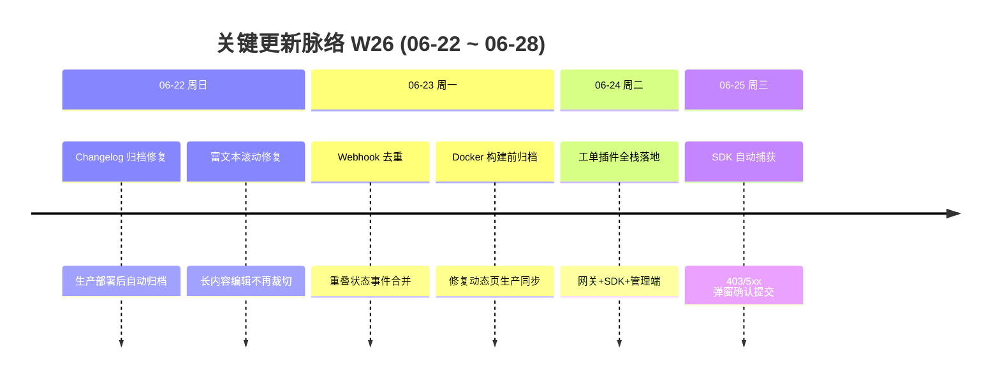

# 周报 2026-W26 (2026-06-22 ~ 2026-06-28)

> **总计 15 次提交 | 75 个文件变更 | +6265 行 / -149 行 | 8 个 PR 合入 (#212 ~ #220，#216 空缺)**
>
> **贡献者**：chenjiaying-miduo (7 commits), github-actions[bot] (5 commits), Cursor Agent (2 commits), cursor[bot] (1 commit)

**本周趋势**：本周从 W25 的「动态」页面迭代转向**业务原生工单插件**大交付——#219 以「文档」标题合入，实际落地接入应用管理、插件开放网关、ticket-sdk UMD 包等 P0-P2 全栈能力；#220 紧随其后升级 SDK v1.1.0 的 HTTP 自动捕获。并行修复 changelog 归档时序（#214、#218）与 Webhook 去重（#217），保障生产「动态」页数据同步。

---

## 关键更新脉络

---

## 一、已合并 Pull Requests (#212 ~ #220)

| PR | 标题 | 分类 |
|----|------|------|
| #212 | W25 周报落盘并同步文档索引 | 📝 文档 |
| #213 | 生产 Docker 环境恢复「动态」页数据 | 🐛 Bug 修复 |
| #214 | 生产部署后自动归档 changelog | 🔧 DevOps |
| #215 | 富文本编辑器溢出内容支持滚动 | 🐛 Bug 修复 |
| #217 | 重叠状态事件 Webhook 通知去重 | 🐛 Bug 修复 |
| #218 | Docker 构建前归档 changelog，修复生产「动态」页同步 | 🔧 DevOps |
| #219 | 业务原生工单插件 Task031 全栈落地（P0-P2） | ✨ 新功能 |
| #220 | ticket-sdk v1.1.0 HTTP 403/5xx 自动捕获并弹窗确认 | ✨ 新功能 |

> #216 编号空缺，本周无对应 PR。

---

## 二、本周完成

### 1. 业务原生工单插件 Task031（P0-P2 全栈落地）— 外部业务系统可嵌入原生提单能力

> **价值**：其他业务系统（如渠道管理）不用跳转工单后台，用户在自己熟悉的页面里 3 步就能提单；处理人打开工单时也能看到完整业务上下文。

- 后端架构
  - 新增 `integration_app` 表（V62 迁移）与工单插件上下文字段
  - 接入应用 CRUD（API527-530）、LaunchToken 签发（531）、插件建单/查单/配置（532-534/536）
  - AppKey 鉴权扩展 + 按应用 Webhook 回调 + 外部用户影子账号映射
- 前端实现
  - 管理端「接入应用」配置面板（`IntegrationAppPanel.vue`）
  - 工单详情插件上下文面板（`PluginContextPanel.vue`）
  - ticket-sdk UMD 包（约 8KB gzip）发布至 `public/sdk/v1/`
- 文档与规范
  - 完整设计方案、Task031 实施路线、接口编号 API000527-536 登记
  - 明确 SDK 暂不做管理后台离线包下载
- 质量保障：更新中心 changelog 同步（#219 含 66 文件、+5499 行，标题为 docs 但实际为完整实现）

### 2. ticket-sdk v1.1.0 HTTP 自动捕获 — 接口报错时一键提单，不静默建单

> **价值**：业务页面接口返回 403 或 5xx 时，用户不用自己描述错误，SDK 自动预填信息后弹窗确认，避免漏报也避免误报。

- 新增 `autoReport` 配置，全局监听 `fetch` / `XHR`
- 新增 `reportHttpError`、`createAxiosInterceptor` 供 axios 项目接入
- `open()` 支持预填描述与自动捕获提示条
- 同 URL+状态码 5 分钟内只提示一次（`debounceMs: 300000`）
- SDK 升级至 v1.1.0，同步 CDN 产物与方案文档

### 3. Changelog 归档与生产发布流水线修复 — 「动态」页生产数据不再滞后

> **价值**：每次生产发布后，「动态」页面能立即看到最新变更记录，不会出现「代码已上线、页面还显示旧内容」的落差。

- #214：生产部署**后**自动归档 changelogs → CHANGELOG.md
- #218：Docker 构建**前**归档，确保镜像内打包最新 changelog 与周报文件
- 本周伴随 5 次 `chore: archive changelogs after production release` 自动发布

### 4. Webhook 通知去重（延续 W25）— 同次流转不再重复推送

> **价值**：工单状态变更时，Webhook 订阅方不会收到多条内容几乎一样的通知，减少噪音。

- #217：`WebhookDispatchService` 对重叠状态事件去重
- 与 W25 #200/#201 企微紧凑通知形成完整推送体验优化链

### 5. 富文本编辑器溢出滚动修复 — 长内容编辑不再被裁切

> **价值**：写长描述或贴大段日志时，编辑区域可以滚动查看全部内容。

- #215：溢出内容区域增加滚动支持

### 6. W25 边界收尾 — 周报归档与生产环境修复

> **价值**：W25 交付物完整归档，生产 Docker 环境「动态」页数据恢复正常。

- #212：W25 周报落盘并同步文档索引（06-21 合入，编号归入本周序列）
- #213：生产 Docker 部署恢复「动态」页数据源（06-21 合入）

### 7. SLA 公开页增强（W25 遗留，本周仍未合入）

> **价值**：客户在公开页能看到准确的 SLA 耗时与时区，已完成的工单不再显示误导性倒计时。

- #198、#199、#202 三个 PR 仍未进入 main，验收未闭环

---

## 三、本周数据

### 每日提交分布

| 日期 | 提交数 | 重点方向 |
|------|--------|----------|
| 06-22 (周日) | 4 | Changelog 部署后归档 (#214)、富文本滚动 (#215)、生产发布 |
| 06-23 (周一) | 6 | Webhook 去重 (#217)、Docker 构建前归档 (#218)、生产发布 |
| 06-24 (周二) | 2 | 工单插件全栈落地 (#219) |
| 06-25 (周三) | 2 | SDK HTTP 自动捕获 (#220)、生产发布 |
| 06-26 ~ 06-28 | 0 | 无提交 |

### 提交类型分布

| 类型 | 数量 | 占比 |
|------|------|------|
| chore (杂项/发布) | 5 | 33% |
| fix (Bug 修复) | 4 | 27% |
| merge (PR 合并) | 4 | 27% |
| feat (新功能) | 1 | 7% |
| docs (文档) | 1 | 7% |

---

## 四、与上周 (W25) 对比

| 指标 | W25 | W26 | 变化 |
|------|-----|-----|------|
| 提交数 | 19 | 15 | -21% |
| 合入 PR 数 | 16 | 8 | -8 |
| 文件变更 | 39 | 75 | +92% |
| 净增行数 | +1650 | +6116 | +270% |

### 上周方向落地情况

| W25 建议方向 | W26 实际进展 |
|--------------|--------------|
| P0 SLA 公开页合入与验收 | ❌ #198、#199、#202 仍未合入 main，第三周挂起 |
| P1 「动态」页面稳定性 | ✅ 生产 Docker 数据恢复 (#213)；changelog 归档时序修复 (#214、#218) |
| P2 MCP WorkBuddy 集成 | ❌ 本周无直接相关交付（主线转向工单插件） |

---

## 五、下周优先级建议

| 优先级 | 方向 | 建议动作 |
|--------|------|----------|
| P0 | SLA 公开页合入与验收 | 合并 #198、#199、#202，按已完成/进行中各造一条缺陷，核对公开页耗时、截止隐藏与时区 |
| P1 | 工单插件端到端验收 | 在测试环境走通「接入应用创建 → LaunchToken 签发 → SDK 嵌入提单 → 处理人查看上下文」全链路；验证 autoReport 403/5xx 弹窗不静默建单 |
| P2 | MCP WorkBuddy 集成 | 在测试环境用 WorkBuddy 走通只读 MCP 查询流程，验证 API 密钥一键复制配置可用性 |
