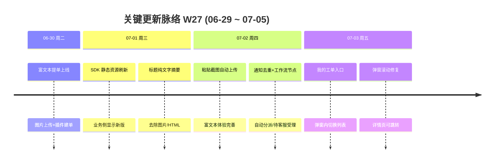

# 周报 2026-W27 (2026-06-29 ~ 2026-07-05)

> **总计 17 次提交 | 30 个文件变更 | +707 行 / -68 行 | 11 个 PR 合入 (#221 ~ #231)**
>
> **贡献者**：chenjiaying-miduo (10 commits), github-actions[bot] (7 commits)

**本周趋势**：本周延续 W26 工单插件主线，进入**快速打磨期**——周二上线富文本提单与图片上传 (#222) 后，周三至周五密集交付 9 个 PR，覆盖 SDK 静态资源同步、标题/描述溢出修复、粘贴截图自动上传、弹窗「我的工单」入口等体验细节；并行补充缺陷退回重提 UX (#225) 与「待客服受理」工作流节点 (#226)。

---

## 关键更新脉络

---

## 一、已合并 Pull Requests (#221 ~ #231)

| PR | 标题 | 分类 |
|----|------|------|
| #221 | W26 周报落盘并同步文档索引 | 📝 文档 |
| #222 | 插件 SDK 富文本提单与图片上传 | ✨ 新功能 |
| #223 | 刷新对外发布的 ticket-sdk 富文本静态资源 | 🐛 Bug 修复 |
| #224 | 插件建单标题改为纯文字摘要，不含图片数据 | 🐛 Bug 修复 |
| #225 | 缺陷报告退回后重新提交的审核状态展示优化 | 🎨 UI/UX |
| #226 | 缺陷工作流复制 SQL（含「待客服受理」节点） | ⚙️ 工作流 |
| #227 | 修复插件工单描述 base64 溢出 | 🐛 Bug 修复 |
| #228 | SDK 支持粘贴图片自动上传 | ✨ 新功能 |
| #229 | 抑制建单自动分派后的重复状态通知 | 🐛 Bug 修复 |
| #230 | 提交弹窗新增「我的工单」入口 | ✨ 新功能 |
| #231 | 修复 SDK 弹窗溢出与工单详情跳转 | 🎨 UI/UX |

> #221 于 06-28 合入，属 W26 边界收尾；本周活跃交付为 #222 ~ #231（10 个 PR）。

---

## 二、本周完成

### 1. 插件 SDK 富文本提单与图片上传 — 用户可贴图、写格式化工单

> **价值**：业务系统里提工单不再只能打纯文字，可以截图说明问题，处理人一眼看懂现场情况。

- 后端：`PluginOpenController` 新增图片上传接口；`PluginTicketApplicationService` 支持富文本描述与附件
- 前端/SDK：`ticket-sdk` 编辑器从 textarea 升级为富文本，支持图片上传与提交
- 文档：Task031 方案与接口编号同步更新
- 后续快速迭代（#223–#224、#227–#228）：静态资源同步、标题纯文字摘要、base64 溢出修复、粘贴截图自动上传

### 2. SDK 弹窗体验完善 — 「我的工单」入口 + 滚动与跳转

> **价值**：用户提完工单不用关弹窗再去找列表，弹窗里就能切到「我的工单」并点进详情，长内容也不会把按钮挤出屏幕。

- #230：提交弹窗新增「我的工单」按钮，同一弹窗内切换列表
- #231：弹窗改为固定视口高度 + 内部滚动；工单列表支持跳转公开详情页

### 3. 通知与分派体验修复 — 建单不再重复推送

> **价值**：工单创建后自动分派时，Webhook/企微不会收到两条几乎一样的状态变更通知。

- #229：`TicketWorkflowAppService` 建单自动分派时抑制重复状态事件；`TicketStatusChangedEvent` 增加来源标记

### 4. 缺陷报告退回重提 UX 优化 — 审核状态一目了然

> **价值**：缺陷被退回后重新提交，提交人和审核人都能清楚看到当前处于什么审核阶段。

- #225：前后端同步优化退回后重提的审核状态展示（`BugReportApplicationService` + 详情/编辑页）

### 5. 缺陷工作流「待客服受理」节点 — 支持复制含新节点的工作流

> **价值**：缺陷流转可以经过「待客服受理」环节，团队可按需复制带该节点的完整工作流模板。

- #226：新增 `20260702_clone_defect_workflow_with_cs_accept.sql`；`TicketStatus` 枚举与看板/列表/公开页状态展示同步

### 6. W26 边界收尾

> **价值**：W26 周报完整归档，文档索引保持最新。

- #221：W26 周报落盘（06-28 合入，编号归入本周序列）

### 7. SLA 公开页增强（W26 遗留，本周仍未合入）

> **价值**：客户在公开页能看到准确的 SLA 耗时与时区。

- #198、#199、#202 仍未进入 main，第四周挂起

---

## 三、本周数据

### 每日提交分布

| 日期 | 提交数 | 重点方向 |
|------|--------|----------|
| 06-30 (周二) | 2 | 富文本提单与图片上传 (#222)、生产发布 |
| 07-01 (周三) | 4 | SDK 静态资源刷新 (#223)、标题纯文字 (#224)、生产发布 |
| 07-02 (周四) | 9 | base64 溢出 (#227)、粘贴上传 (#228)、通知去重 (#229)、缺陷 UX (#225)、工作流 SQL (#226) |
| 07-03 (周五) | 2 | 我的工单入口 (#230)、弹窗滚动与跳转 (#231) |
| 06-29、07-04 ~ 07-05 | 0 | 无提交 |

### 提交类型分布

| 类型 | 数量 | 占比 |
|------|------|------|
| chore (杂项/发布) | 7 | 41% |
| fix (Bug 修复) | 5 | 29% |
| feat (新功能) | 3 | 18% |
| docs (文档) | 1 | 6% |
| 其他 (无前缀) | 1 | 6% |

---

## 四、与上周 (W26) 对比

| 指标 | W26 | W27 | 变化 |
|------|-----|-----|------|
| 提交数 | 15 | 17 | +13% |
| 合入 PR 数 | 8 | 10 | +2 |
| 文件变更 | 75 | 30 | -60% |
| 净增行数 | +6116 | +639 | -90% |

> W26 以 Task031 全栈首交付为主（单 PR +5499 行），W27 转为 SDK 体验打磨，变更集中在 `ticket-sdk` 与插件服务，行数回落但 PR 密度更高。

### 上周方向落地情况

| W26 建议方向 | W27 实际进展 |
|--------------|--------------|
| P0 SLA 公开页合入与验收 | ❌ #198、#199、#202 仍未合入 main，第四周挂起 |
| P1 工单插件端到端验收 | ✅ 富文本提单 (#222)、图片上传/粘贴 (#228)、我的工单入口 (#230)、弹窗体验 (#231) 陆续交付；全链路验收可进入回归 |
| P2 MCP WorkBuddy 集成 | ❌ 本周无直接相关交付 |

---

## 五、下周优先级建议

| 优先级 | 方向 | 建议动作 |
|--------|------|----------|
| P0 | SLA 公开页合入与验收 | 合并 #198、#199、#202，按已完成/进行中各造一条缺陷，核对公开页耗时、截止隐藏与时区 |
| P1 | 工单插件生产验收 | 在真实业务系统嵌入 SDK，走通富文本提单→图片上传→我的工单→公开详情全链路；关注 CDN 缓存与静态资源版本 |
| P2 | 「待客服受理」工作流上线 | 在测试环境执行 #226 SQL，验证缺陷流转经过新节点时看板/通知/公开页状态一致 |
