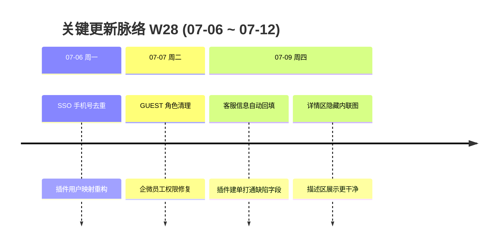

# 周报 2026-W28 (2026-07-06 ~ 2026-07-12)

> **总计 6 次提交 | 15 个文件变更 | +710 行 / -56 行 | 5 个 PR 合入 (#232 ~ #236)**
>
> **贡献者**：chenjiaying-miduo (4 commits), github-actions[bot] (2 commits)

**本周趋势**：本周从 W27 的 SDK 功能扩展转向**插件身份与缺陷数据打通**——修复插件外部用户手机号冲突导致 SSO 登录失败 (#233)、企微员工误加 GUEST 角色 (#234) 两个线上隐患后，上线插件建单自动回填缺陷客服信息 (#235)，并优化工单详情描述区图片展示 (#236)。交付节奏放缓，但每条都直指生产可用性。

---

## 关键更新脉络

---

## 一、已合并 Pull Requests (#232 ~ #236)

| PR | 标题 | 分类 |
|----|------|------|
| #232 | W27 周报落盘并同步文档索引 | 📝 文档 |
| #233 | 修复插件用户手机号冲突导致 SSO 登录失败 | 🐛 Bug 修复 |
| #234 | 阻止插件映射给企微员工误加 GUEST 角色并清理历史数据 | 🔐 权限 |
| #235 | 插件建单自动回填缺陷客服信息字段 | ✨ 新功能 |
| #236 | 工单详情描述区隐藏内联图片 | 🎨 UI/UX |

> #232 于 07-06 凌晨合入，属 W27 边界收尾；本周活跃交付为 #233 ~ #236（4 个 PR）。

---

## 二、本周完成

### 1. 插件外部用户身份映射重构 — 修复 SSO 手机号冲突

> **价值**：外部业务系统用户通过插件提单后，用企微 SSO 登录工单系统不再因手机号重复而失败，身份映射更可靠。

- 后端：`PluginUserMappingService` 重构，新增 `plugin_external_user` 映射表（V63 迁移）
- 查询优先级：`SysUserQueryPriority` 统一用户查找逻辑，避免手机号撞车
- 文档：输出插件用户 SSO 手机号冲突修复方案

### 2. 企微员工 GUEST 角色误加修复 — 权限回归正常

> **价值**：企微同步进来的正式员工不会被错误标记为访客，避免权限不足或数据访问异常。

- #234：`PluginUserMappingService` 增加角色校验，阻止给企微员工加 GUEST
- 数据修复：V64 迁移脚本清理历史误加数据

### 3. 插件建单自动回填缺陷客服信息 — 处理人不用手工补字段

> **价值**：用户通过 SDK 提的缺陷工单，客服信息（商户编号、公司名称、问题描述、截图等）自动填好，处理人打开就能开工。

- 后端：`PluginTicketApplicationService` 扩展，建单时同步写入 `ticket_bug_info`
- SDK：上下文与 LaunchToken 中的商户/场景信息自动带入
- 问题描述与附件 URL 分别映射到「问题描述」「问题截图」字段

### 4. 工单详情描述区隐藏内联图片 — 富文本展示更整洁

> **价值**：富文本描述里的内联图片不再在正文区重复展示，截图统一走附件或客服信息区域，避免页面杂乱。

- 前端：`ticket-description-display.ts` 过滤内联图片；`TicketDetailView.vue` 调整展示逻辑

### 5. W27 边界收尾

> **价值**：W27 周报完整归档，文档索引保持最新。

- #232：W27 周报落盘（07-06 凌晨合入）

### 6. SLA 公开页增强（遗留，本周仍未合入）

> **价值**：客户在公开页能看到准确的 SLA 耗时与时区。

- #198、#199、#202 仍未进入 main，第五周挂起

---

## 三、本周数据

### 每日提交分布

| 日期 | 提交数 | 重点方向 |
|------|--------|----------|
| 07-06 (周一) | 2 | 插件用户 SSO 手机号去重 (#233)、生产发布 |
| 07-07 (周二) | 2 | 企微员工 GUEST 角色清理 (#234)、生产发布 |
| 07-09 (周四) | 2 | 缺陷客服信息自动回填 (#235)、详情区图片展示 (#236) |
| 07-08、07-10 ~ 07-12 | 0 | 无提交 |

### 提交类型分布

| 类型 | 数量 | 占比 |
|------|------|------|
| fix (Bug 修复) | 3 | 50% |
| chore (杂项/发布) | 2 | 33% |
| feat (新功能) | 1 | 17% |

---

## 四、与上周 (W27) 对比

| 指标 | W27 | W28 | 变化 |
|------|-----|-----|------|
| 提交数 | 17 | 6 | -65% |
| 合入 PR 数 | 10 | 4 | -6 |
| 文件变更 | 30 | 15 | -50% |
| 净增行数 | +639 | +654 | +2% |

> W27 为 SDK 富文本密集迭代周（10 PR / 4 天），W28 节奏放缓，聚焦插件身份安全与缺陷数据打通，单条 PR 平均变更量更大。

### 上周方向落地情况

| W27 建议方向 | W28 实际进展 |
|--------------|--------------|
| P0 SLA 公开页合入与验收 | ❌ #198、#199、#202 仍未合入 main，第五周挂起 |
| P1 工单插件生产验收 | ✅ SSO 身份修复 (#233、#234)、缺陷客服信息自动回填 (#235)、详情展示优化 (#236)；生产可用性显著提升 |
| P2 「待客服受理」工作流上线 | ❌ 本周无直接相关交付 |

---

## 五、下周优先级建议

| 优先级 | 方向 | 建议动作 |
|--------|------|----------|
| P0 | SLA 公开页合入与验收 | 合并 #198、#199、#202，按已完成/进行中各造一条缺陷，核对公开页耗时、截止隐藏与时区 |
| P1 | 插件生产回归 | 在真实业务系统验证 SSO 登录 + 插件提单 + 客服信息自动回填全链路；确认 V63/V64 迁移后历史用户数据正常 |
| P2 | 「待客服受理」工作流上线 | 在测试环境执行 #226 SQL，验证缺陷流转经过新节点时看板/通知/公开页状态一致 |
