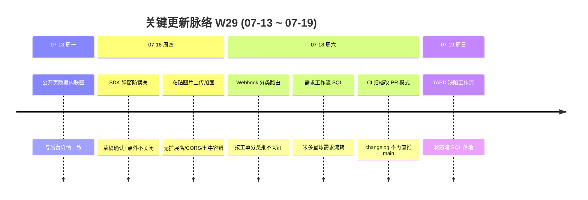

# 周报 2026-W29 (2026-07-13 ~ 2026-07-19)

> **总计 19 次提交 | 43 个文件变更 | +1295 行 / -90 行 | 17 个 PR 合入 (#237 ~ #253)**
>
> **贡献者**：chenjiaying-miduo (14 commits), miduo-admin (4 commits), zhangsj (1 commit)

**本周趋势**：本周交付密度大幅回升——周六单日集中合入 10 个 PR，覆盖 Webhook 分类路由、米多星球需求工作流、CI changelog 归档改造三条主线；前半周则聚焦插件 SDK 弹窗体验与粘贴图片上传稳定性（#238–#243）。工作流 SQL 新增两条（需求 #246、TAPD 缺陷 #253），通知能力从「全局推送」升级为「按分类定向到不同企微群」。

---

## 关键更新脉络

---

## 一、已合并 Pull Requests (#237 ~ #253)

| PR | 标题 | 分类 |
|----|------|------|
| #237 | W28 周报落盘并同步文档索引 | 📝 文档 |
| #238 | 公开页与预览视图隐藏描述区内联图片 | 🐛 Bug 修复 |
| #239 | 阻止插件提交弹窗点击外部区域自动关闭 | 🐛 Bug 修复 |
| #240 | 插件弹窗关闭前增加草稿丢失确认 | ✨ 新功能 |
| #241 | 修复粘贴图片无扩展名时上传失败 | 🐛 Bug 修复 |
| #242 | 加固插件粘贴图片上传失败处理 | 🐛 Bug 修复 |
| #243 | 修复插件图片上传 CORS 导致的 failed-to-fetch | 🐛 Bug 修复 |
| #244 | 导航菜单「分类工单」更名为「工单分类」 | 🎨 UI/UX |
| #245 | Webhook 工单通知按分类路由到不同企微群 | ✨ 新功能 |
| #246 | 新增米多星球需求工作流 SQL | ⚙️ 工作流 |
| #247 | CI changelog 归档改为通过 PR 合入而非直推 main | 🔧 DevOps |
| #248 | CD 流水线配置调整（gh token 相关） | 🔧 DevOps |
| #249 | CD 流水线配置调整（归档步骤优化） | 🔧 DevOps |
| #250 | 修复 Webhook 配置保存时分类适用范围未持久化 | 🐛 Bug 修复 |
| #251 | 修复 CI changelog 归档 PR 正文引号转义 | 🔧 DevOps |
| #252 | 修复 CI 使用 github.token 创建 changelog 归档 PR | 🔧 DevOps |
| #253 | 新增 TAPD 缺陷状态流工作流 SQL | ⚙️ 工作流 |

> #237 于 07-12 合入，属 W28 边界收尾；本周活跃交付为 #238 ~ #253（16 个 PR）。

---

## 二、本周完成

### 1. Webhook 按分类路由到企微群 — 不同工单类型推不同群

> **价值**：缺陷、需求、咨询等不同类型的工单，可以分别通知到对应的企微群，同事不用在无关群里被刷屏。

- 后端：`WebhookCategoryScopeMatcher` 匹配分类范围；`WebhookDispatchService` 按配置路由；V65 迁移新增 `category_scope` 字段
- 前端：`WebhookConfigPanel` 支持配置适用分类范围
- 修复：#250 保存时分类范围持久化
- 文档：输出分类路由 Webhook 方案

### 2. 工作流 SQL 新增两条 — 米多星球需求 + TAPD 缺陷状态流

> **价值**：需求和 TAPD 缺陷可以各自走专属流转路径，不再共用一套通用流程。

- #246：米多星球需求工作流初始化 SQL + 回滚脚本；`TicketStatus` 枚举与看板/列表状态展示同步
- #253：TAPD 缺陷状态流工作流 SQL；前端状态工具与徽章更新

### 3. 插件 SDK 弹窗与图片上传体验加固 — 6 个 PR 连续打磨

> **价值**：用户提工单时不会误关弹窗丢草稿，粘贴截图上传更稳定，公开页展示也更整洁。

- 弹窗交互：#239 禁止点外部关闭；#240 关闭前草稿丢失确认
- 图片上传：#241 无扩展名文件名兼容；#242 上传失败容错与异常处理；#243 `PluginCorsHeaderFilter` 修复 CORS
- 展示统一：#238 公开页与预览视图隐藏描述区内联图片（延续 #236 后台详情修复）

### 4. CI/CD changelog 归档流程改造 — 从直推 main 改为 PR 合入

> **价值**：生产发布后 changelog 归档不再直接推 main，走 PR 审核，避免流水线权限过大或推送失败。

- #247：CD 流水线改为 `gh pr create` 创建归档 PR
- #248、#249：miduo-admin 补充调整 CD 配置
- #251、#252：修复 PR 正文引号转义与 `github.token` 权限问题

### 5. 导航文案优化

> **价值**：菜单名称更符合用户心智——「工单分类」比「分类工单」更顺口。

- #244：`MainLayout` 菜单、路由、`TicketView` 枚举统一更名

### 6. W28 边界收尾

> **价值**：W28 周报完整归档。

- #237：W28 周报落盘（07-12 合入）

### 7. SLA 公开页增强（遗留，本周仍未合入）

> **价值**：客户在公开页能看到准确的 SLA 耗时与时区。

- #198、#199、#202 仍未进入 main，第六周挂起

---

## 三、本周数据

### 每日提交分布

| 日期 | 提交数 | 重点方向 |
|------|--------|----------|
| 07-13 (周一) | 1 | 公开页/预览隐藏内联图 (#238) |
| 07-15 (周三) | 1 | 插件弹窗防误关 (#239) |
| 07-16 (周四) | 5 | 草稿确认 (#240)、粘贴图片三连修 (#241–#243) |
| 07-17 (周五) | 1 | 导航「工单分类」更名 (#244) |
| 07-18 (周六) | 10 | Webhook 分类路由 (#245、#250)、需求工作流 (#246)、CI 归档改造 (#247–#252) |
| 07-19 (周日) | 1 | TAPD 缺陷工作流 SQL (#253) |

### 提交类型分布

| 类型 | 数量 | 占比 |
|------|------|------|
| fix (Bug 修复) | 10 | 53% |
| feat (新功能) | 4 | 21% |
| DevOps/CD | 5 | 26% |

---

## 四、与上周 (W28) 对比

| 指标 | W28 | W29 | 变化 |
|------|-----|-----|------|
| 提交数 | 6 | 19 | +217% |
| 合入 PR 数 | 4 | 16 | +12 |
| 文件变更 | 15 | 43 | +187% |
| 净增行数 | +654 | +1205 | +84% |

> W28 为生产修复小步迭代，W29 周六单日爆发 10 PR，Webhook 路由与工作流 SQL 成为新主线。

### 上周方向落地情况

| W28 建议方向 | W29 实际进展 |
|--------------|--------------|
| P0 SLA 公开页合入与验收 | ❌ #198、#199、#202 仍未合入 main，第六周挂起 |
| P1 插件生产回归 | ✅ 弹窗防误关 (#239、#240)、粘贴图片上传全链路加固 (#241–#243)、公开页展示 (#238) |
| P2 「待客服受理」工作流上线 | ⚠️ 新增米多星球需求 (#246) 与 TAPD 缺陷 (#253) 工作流 SQL，但 #226「待客服受理」节点未单独验收 |

---

## 五、下周优先级建议

| 优先级 | 方向 | 建议动作 |
|--------|------|----------|
| P0 | SLA 公开页合入与验收 | 合并 #198、#199、#202，按已完成/进行中各造一条缺陷，核对公开页耗时、截止隐藏与时区 |
| P1 | Webhook 分类路由生产验证 | 配置两条 Webhook（不同分类范围），各造一条工单，确认通知路由到正确企微群 |
| P2 | 新工作流 SQL 上线 | 在测试环境执行 #246、#253 SQL，验证需求/缺陷流转节点与看板/通知/公开页状态一致 |
