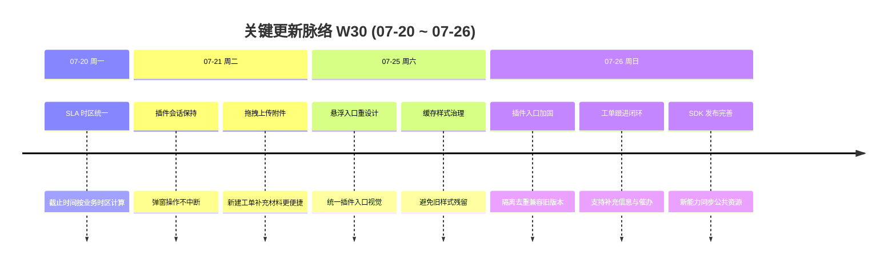

# 周报 2026-W30 (2026-07-20 ~ 2026-07-26)

> **总计 30 次提交 | 24 个文件变更 | +1,385 行 / -67 行 | 13 个 PR 合入 (#255 ~ #267)**
>
> **贡献者**：chenjiaying-miduo (30 commits)

**本周趋势**：本周围绕**工单插件生产体验与闭环能力**集中交付：前半周修正 SLA 业务时区、延长插件会话并补齐新建工单拖拽附件；周末连续打磨悬浮入口的样式隔离、缓存、去重和兼容性，随后上线工单详情查询、补充信息与催办能力，使插件从「能提单」进一步演进为「能持续跟进」。

---

## 关键更新脉络

---

## 一、已合并 Pull Requests (#255 ~ #267)

| PR | 标题 | 分类 |
|----|------|------|
| #255 | SLA 工作时间计算统一使用业务时区 | 🐛 Bug 修复 |
| #256 | 保持插件弹窗会话并延长 LaunchToken 有效期 | 🐛 Bug 修复 |
| #257 | 新建工单页支持拖拽上传附件 | ✨ 新功能 |
| #258 | 重新设计工单插件悬浮按钮 | 🎨 UI/UX |
| #259 | 防止插件入口旧样式缓存残留 | 🐛 Bug 修复 |
| #260 | 隔离宿主页面与插件入口样式 | 🐛 Bug 修复 |
| #261 | 去除重复的工单插件入口 | 🐛 Bug 修复 |
| #262 | 移除遗留的内联工单入口 | 🐛 Bug 修复 |
| #263 | 持续确保页面仅保留一个工单入口 | 🐛 Bug 修复 |
| #264 | 暴露兼容旧版本的 TicketSDK 悬浮入口根节点 | 🐛 Bug 修复 |
| #265 | 插件支持工单跟进、补充信息与催办 | ✨ 新功能 |
| #266 | 发布包含跟进能力的新版 SDK 资源 | 🔧 DevOps |
| #267 | 增强补充记录并限制催办频率 | 🔄 更新 |

---

## 二、本周完成

### 1. 插件工单跟进闭环 — 从提单扩展到持续处理

> **价值**：外部业务系统用户无需跳出当前系统，就能查看工单进展、继续补充材料并发起催办，减少来回沟通成本。

- 后端开放插件工单详情、补充信息和催办接口，并统一校验插件用户与工单归属
- SDK 增加工单详情视图和跟进操作，串联「提交—查看—补充—催办」完整流程
- 补充记录展示进一步完善，便于处理人与提交人理解上下文
- 催办增加频率限制，避免短时间重复操作干扰处理流程
- SDK 构建发布脚本同步更新公共静态资源，确保宿主系统加载到完整能力

### 2. 插件悬浮入口稳定性专项治理 — 兼容不同宿主页面

> **价值**：插件嵌入不同业务系统时，入口保持一致、唯一且可用，不再受宿主样式、浏览器缓存或旧版代码影响。

- 重做悬浮按钮视觉与交互，让入口更清晰且与业务页面协调
- 通过样式隔离避免宿主 CSS 改写插件按钮，同时阻断插件样式污染宿主页面
- 调整静态资源缓存策略，避免发布后仍命中旧版入口样式
- 清理遗留内联入口，并对重复加载场景持续执行单实例约束
- 暴露兼容旧版 TicketSDK 的悬浮根节点，降低存量接入升级风险

### 3. 插件弹窗会话保持 — 操作过程不再意外中断

> **价值**：用户在插件中登录、填写和查看工单时，弹窗不会因焦点切换或短会话失效而关闭，长时间操作更可靠。

- 调整 SDK 弹窗生命周期，避免登录跳转或页面交互触发误关闭
- 延长 LaunchToken 会话并同步后端配置，减少操作中途重新认证
- 补充插件会话保持方案与接入说明，方便业务系统排查集成问题

### 4. 新建工单支持拖拽上传附件 — 材料提交更顺手

> **价值**：用户可直接把截图、日志等文件拖入新建工单页面，减少选择文件的操作步骤并降低漏传概率。

- 新建工单附件区支持拖入文件并复用既有上传、预览与删除流程
- 保持文件类型、数量与大小校验一致，避免拖拽绕过原有规则

### 5. SLA 业务时区统一 — 消除容器时区造成的截止偏差

> **价值**：SLA 截止时间与团队实际工作时间一致，处理人和管理者不再看到相差 8 小时的错误期限。

- 新增业务时区解析能力，从系统配置读取统一时区
- 工作时间计算与 SLA 计时服务不再依赖 JVM 默认时区
- 对运行中的计时器按剩余工作分钟重算截止时间，修正历史错误数据

---

## 三、本周数据

### 每日提交分布

| 日期 | 提交数 | 重点方向 |
|------|--------|----------|
| 07-20 (周一) | 1 | SLA 业务时区统一 (#255) |
| 07-21 (周二) | 2 | 插件弹窗会话保持、新建工单拖拽附件 (#256、#257) |
| 07-25 (周六) | 3 | 插件悬浮按钮重设计与缓存样式治理 (#258、#259) |
| 07-26 (周日) | 24 | 插件入口稳定性加固、工单跟进与催办闭环 (#260 ~ #267) |
| 07-22 ~ 07-24 | 0 | 无提交 |

### 提交类型分布

> 以下按 13 个 PR 的功能提交归类，不计 17 条 PR/分支合并记录。

| 类型 | 数量 | 占比 |
|------|------|------|
| fix (Bug 修复) | 9 | 69% |
| feat (新功能) | 3 | 23% |
| style (样式) | 1 | 8% |

---

## 四、与上周 (W29) 对比

> 仓库中暂无 `doc/report.2026-W29.md`，无法可靠读取 W29 的统计指标与优先级建议，因此本周不生成环比和「上周方向落地情况」，避免使用估算数据。

---

## 五、下周优先级建议

| 优先级 | 方向 | 建议动作 |
|--------|------|----------|
| P0 | 插件跟进闭环生产验收 | 在真实宿主系统覆盖查看详情、补充文字/附件、催办频控、身份越权与异常重试，确认新版 SDK 资源已刷新 |
| P1 | 插件入口兼容性回归 | 选择样式体系和加载方式不同的存量系统，验证缓存刷新、重复初始化、旧版入口清理和移动端展示 |
| P2 | SLA 时区修复核验 | 按工作时段内外、跨午休和跨工作日场景造数，核对新旧计时器截止时间及提醒任务执行结果 |
