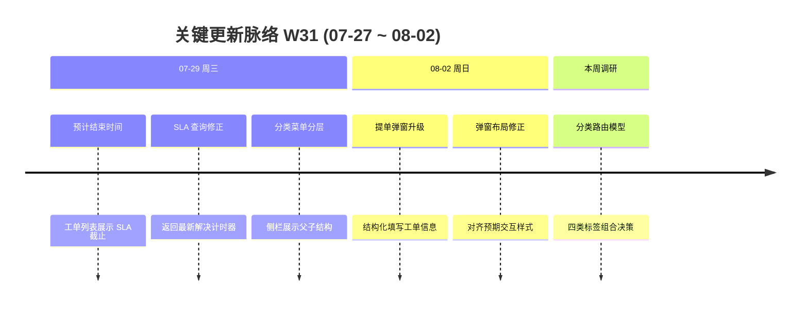

# 周报 2026-W31 (2026-07-27 ~ 2026-08-02)

> **总计 12 次提交 | 11 个文件变更 | +380 行 / -126 行 | 6 个 PR 合入 (#268 ~ #273)**
>
> **贡献者**：chenjiaying-miduo (12 commits)

**本周趋势**：本周一边推进**工单分类与自动路由机制调研**，初步形成以「产品归属 × 问题类型 × 紧急程度 × 问题来源」联合决定工作流、处理组和响应时间的思路；一边完成 SLA 预计结束时间展示、分类菜单层级优化和插件提单弹窗升级。工作从上周的插件稳定性治理，转向「分类路由方案设计 + 工单信息透明度 + 插件提单体验」并行推进。

---

## 关键更新脉络



---

## 一、已合并 Pull Requests (#268 ~ #273)

| PR | 标题 | 分类 |
|----|------|------|
| #268 | W30 周报归档并同步文档索引 | 📝 文档 |
| #269 | 工单列表展示预计结束时间 | ✨ 新功能 |
| #270 | 修复 SLA 预计结束时间并返回最新解决计时器 | 🐛 Bug 修复 |
| #271 | 工单分类菜单展示父子层级 | ✨ 新功能 |
| #272 | 升级插件结构化提单弹窗 | ✨ 新功能 |
| #273 | 修正插件提单弹窗布局与交互 | 🐛 Bug 修复 |

> #268 于 07-26 深夜合入，按「从上周最后一个 PR #267 之后开始」的规则纳入本期 PR 范围；本周日期窗口内的活跃交付为 #269 ~ #273。

---

## 二、本周完成

### 1. 工单分类与自动路由机制调研 — 用标签组合决定处理路径

> **价值**：让工单创建后自动进入正确流程、分配给合适团队并获得匹配的响应承诺，减少人工判断、转派和等待。

初步确定四类核心标签：

| 标签维度 | 回答的问题 | 示例 | 主要影响 |
|----------|------------|------|----------|
| 产品归属 | 问题属于哪个产品或业务域？ | 工单系统、营销云、数据平台 | 默认责任团队与可选工作流范围 |
| 问题类型 | 用户需要解决什么性质的问题？ | 缺陷、需求、咨询、配置、数据修复 | 处理步骤、必填材料与验收方式 |
| 紧急程度 | 问题影响和处理优先级如何？ | 一般、紧急、阻断 | 响应时限、升级规则与通知强度 |
| 问题来源 | 工单从什么渠道或场景进入？ | 内部反馈、客户提交、监控告警、插件 | 接入校验、初始节点与服务承诺 |

四类标签组合形成一条路由规则：

```text
产品归属 × 问题类型 × 紧急程度 × 问题来源
                        ↓
          工作流 + 处理组 + 响应时间
```

- **工作流**：决定工单经过客服受理、产品确认、研发处理、测试验证或结果回访等节点
- **处理组**：决定首个责任团队和后续节点候选团队，避免仅分到个人造成单点阻塞
- **响应时间**：根据影响等级和服务场景匹配首响、处理或解决时限，并作为 SLA 计时依据
- 先由「产品归属 + 问题类型」确定基础路由，再由「紧急程度 + 问题来源」修正优先级和 SLA
- 标签缺失或无精确规则时进入默认受理组；规则命中结果保留快照，以便追溯和人工改派

### 2. 工单预计结束时间展示 — SLA 进度更透明

> **价值**：处理人可以直接在工单列表判断剩余处理窗口，优先处理即将超时的事项，不必逐条打开详情核对。

- #269：后端查询补充预计结束时间，前端工单列表增加对应展示
- #270：修正 SLA 查询逻辑，选择最新的「解决」计时器，避免历史或非目标计时器造成截止时间错误
- 补充预计结束时间与超时时长的需求分析，为后续超时风险展示提供依据

### 3. 插件结构化提单弹窗升级 — 提交信息更完整

> **价值**：插件用户能在统一弹窗中明确填写标题、分类和附件等信息，处理团队收到的工单更规范，减少二次追问。

- #272：升级 SDK 提单界面与提交模型，支持结构化标题、工单分类及图片、视频等附件
- 后端插件建单输入和应用服务同步扩展，确保新增字段完整落库
- 更新并发布前端 SDK 静态资源，使宿主系统可以直接加载新版能力
- #273：调整弹窗布局、字段排列和交互细节，使最终页面与预期设计一致

### 4. 工单分类菜单层级展示 — 分类关系更清晰

> **价值**：用户能从侧栏直接理解分类的父子关系，更快找到目标工单入口，也为后续分类路由规则配置打下界面基础。

- #271：侧栏菜单组件支持工单分类父子层级展示
- 主布局按分类结构组织入口，避免不同层级平铺后难以辨认

### 5. W30 周报归档

> **价值**：阶段性交付记录进入统一文档目录，便于后续检索、复盘和规划。

- #268：新增 W30 周报并同步 `doc/index.yml` 与文档目录

---

## 三、本周数据

### 每日提交分布

| 日期 | 提交数 | 重点方向 |
|------|--------|----------|
| 07-29 (周三) | 7 | SLA 预计结束时间展示与修正、分类菜单层级 (#269 ~ #271) |
| 08-02 (周日) | 5 | 插件结构化提单弹窗升级与布局修正 (#272、#273) |
| 07-27、07-28、07-30 ~ 08-01 | 0 | 分类路由方案调研，无代码提交 |

### 提交类型分布

> 以下按 6 个 PR 的主要功能提交归类，不重复计算分支合并记录。

| 类型 | 数量 | 占比 |
|------|------|------|
| feat (新功能) | 3 | 50% |
| fix (Bug 修复) | 2 | 33% |
| docs (文档) | 1 | 17% |

---

## 四、与上周 (W30) 对比

| 指标 | W30 | W31 | 变化 |
|------|-----|-----|------|
| 提交数 | 30 | 12 | -60% |
| 合入 PR 数 | 13 | 6 | -7 |
| 文件变更 | 24 | 11 | -54% |
| 净增行数 | +1,318 | +254 | -81% |

> W31 交付节奏较 W30 放缓，但并非研发空档：除分类路由方案调研外，已交付 SLA 时间展示、分类菜单层级和插件结构化提单三条代码主线。

### 上周方向落地情况

| W30 建议方向 | W31 实际进展 |
|--------------|--------------|
| P0 插件跟进闭环生产验收 | ⚠️ 未见完整验收记录；但插件结构化提单弹窗继续升级 (#272、#273) |
| P1 插件入口兼容性回归 | ⚠️ 本周重点转向提单弹窗，未见悬浮入口专项回归记录 |
| P2 SLA 时区修复核验 | ✅ 工单列表上线预计结束时间，并修正最新解决计时器查询 (#269、#270) |

---

## 五、下周优先级建议

| 优先级 | 方向 | 建议动作 |
|--------|------|----------|
| P0 | 分类标签字典定稿 | 与客服、产品、研发确认四类标签的枚举、定义、必填条件和维护责任人，控制首版枚举规模 |
| P0 | 路由决策表原型 | 用历史工单整理「标签组合 → 工作流、处理组、响应时间」决策表，验证覆盖率、冲突率和兜底规则 |
| P1 | 插件结构化提单验收 | 在真实宿主系统验证标题、分类、图片/视频附件、弹窗布局与异常重试，并确认新版 SDK 缓存刷新 |
| P1 | SLA 时间展示回归 | 覆盖多计时器、暂停恢复、跨工作日与已超时场景，核对列表预计结束时间始终取最新解决计时器 |
| P2 | 分类路由小范围试点 | 选择一个产品和两类高频问题，以「系统推荐、人工确认」方式观察路由准确率，再决定是否自动分派 |
