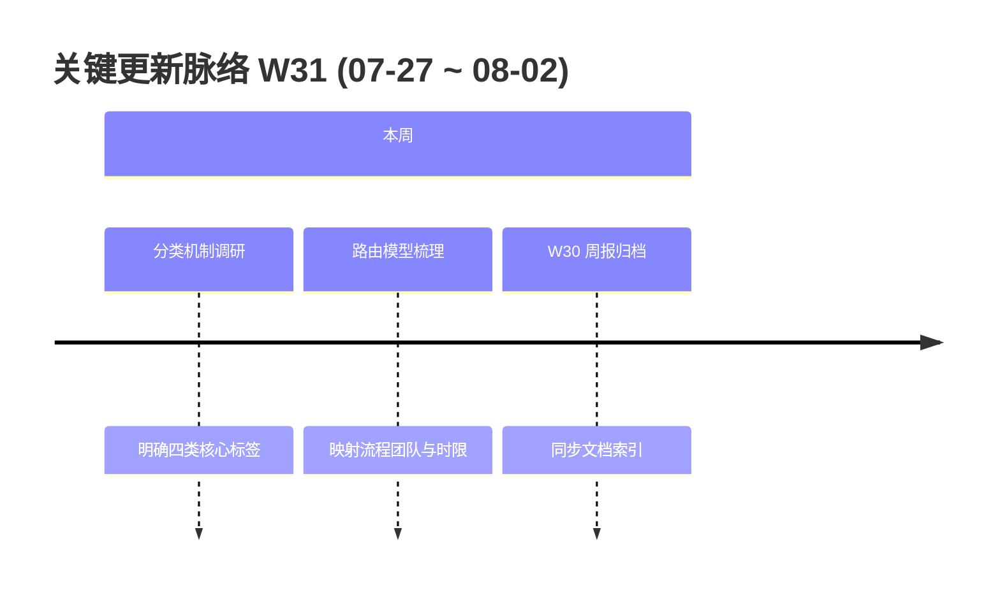

# 周报 2026-W31 (2026-07-27 ~ 2026-08-02)

> **总计 1 次提交 | 3 个文件变更 | +139 行 / -0 行 | 0 个 PR 合入**
>
> **贡献者**：Codex (1 commit)

**本周趋势**：本周研发交付进入短暂空档期，代码侧仅完成 W30 周报归档；工作重心转向**工单分类与自动路由机制调研**，初步形成以「产品归属 × 问题类型 × 紧急程度 × 问题来源」四类标签为输入，联合决定处理工作流、责任处理组和响应时限的方案思路。

---

## 关键更新脉络



---

## 一、已合并 Pull Requests

本周无新增 PR；上一周期最后一个已知 PR 为 #267。

---

## 二、本周完成

### 1. 工单分类与自动路由机制调研 — 从单一分类转向标签组合决策

> **价值**：让工单在创建时就能进入正确流程、分配给合适团队并获得匹配的响应承诺，减少人工判断、转派和等待。

初步确定四类核心标签：

| 标签维度 | 回答的问题 | 示例 | 主要影响 |
|----------|------------|------|----------|
| 产品归属 | 问题属于哪个产品或业务域？ | 工单系统、营销云、数据平台 | 默认责任团队与可选工作流范围 |
| 问题类型 | 用户需要解决什么性质的问题？ | 缺陷、需求、咨询、配置、数据修复 | 处理步骤、必填材料与验收方式 |
| 紧急程度 | 问题影响和处理优先级如何？ | 一般、紧急、阻断 | 响应时限、升级规则与通知强度 |
| 问题来源 | 工单从什么渠道或场景进入？ | 内部反馈、客户提交、监控告警、插件 | 接入校验、初始节点与服务承诺 |

四类标签不各自独立决定结果，而是组合成一条路由规则：

```text
产品归属 × 问题类型 × 紧急程度 × 问题来源
                        ↓
          工作流 + 处理组 + 响应时间
```

- **工作流**：决定工单需要经过哪些节点，例如客服受理、产品确认、研发处理、测试验证和结果回访
- **处理组**：决定首个责任团队以及后续节点的候选处理团队，避免仅分到个人造成单点阻塞
- **响应时间**：根据影响等级和服务场景匹配首响、处理或解决时限，并作为 SLA 计时依据

### 2. 路由规则设计原则 — 可解释、可维护、可兜底

> **价值**：业务人员能够理解系统为何这样分配，管理员也能在产品和团队变化时安全调整规则。

- 先通过「产品归属 + 问题类型」确定基础路由，再由「紧急程度 + 问题来源」修正优先级和 SLA
- 同一组合只命中一条最高优先级规则；冲突时应提示管理员，而不是随机分配
- 标签缺失或没有精确规则时进入明确的默认受理组，防止工单无人处理
- 规则结果应保留命中记录，便于追溯当时采用的工作流、处理组和响应时间
- 规则配置变更只影响新工单；存量工单是否重算需提供显式操作，避免流程被意外切换

### 3. W30 周报归档 — 保持文档可发现

> **价值**：阶段性交付记录能够通过统一目录检索，为后续复盘和规划提供依据。

- 新增 W30 周报并同步 `doc/index.yml` 与文档目录
- 本周尚无工单分类方案的代码或配置交付，当前成果属于方案调研与模型梳理

---

## 三、本周数据

### 每日提交分布

| 日期 | 提交数 | 重点方向 |
|------|--------|----------|
| 08-02 (周日) | 1 | W30 周报归档与文档索引同步 |
| 07-27 ~ 08-01 | 0 | 工单分类与自动路由机制调研，无代码提交 |

### 提交类型分布

| 类型 | 数量 | 占比 |
|------|------|------|
| docs (文档) | 1 | 100% |

---

## 四、与上周 (W30) 对比

| 指标 | W30 | W31 | 变化 |
|------|-----|-----|------|
| 提交数 | 30 | 1 | -97% |
| 合入 PR 数 | 13 | 0 | -13 |
| 文件变更 | 24 | 3 | -88% |
| 净增行数 | +1,318 | +139 | -89% |

> W31 的低代码交付量对应方案调研阶段，不代表工作停滞；本周产出主要是工单分类维度和组合路由模型的初步思路，尚未形成可运行实现。

### 上周方向落地情况

| W30 建议方向 | W31 实际进展 |
|--------------|--------------|
| P0 插件跟进闭环生产验收 | ⚠️ 本周无对应代码或验收记录 |
| P1 插件入口兼容性回归 | ⚠️ 本周无对应代码或回归记录 |
| P2 SLA 时区修复核验 | ⚠️ 本周无对应代码或核验记录 |

---

## 五、下周优先级建议

| 优先级 | 方向 | 建议动作 |
|--------|------|----------|
| P0 | 分类标签字典定稿 | 与客服、产品、研发共同确认四类标签的枚举、定义、必填条件和维护责任人，优先控制枚举规模 |
| P0 | 路由决策表原型 | 用真实历史工单整理「标签组合 → 工作流、处理组、响应时间」决策表，验证覆盖率、冲突率与默认兜底 |
| P1 | 规则优先级与追溯设计 | 明确精确匹配、通配规则、默认规则的优先级，并定义命中规则快照和人工改派记录 |
| P1 | 小范围试运行 | 选择一个产品和两类高频问题先行配置，采用系统推荐、人工确认模式观察准确率，不立即全自动分派 |
| P2 | 上周技术项补验 | 补充插件跟进闭环、入口兼容性和 SLA 时区修复的生产验证记录，避免遗留风险继续累积 |
