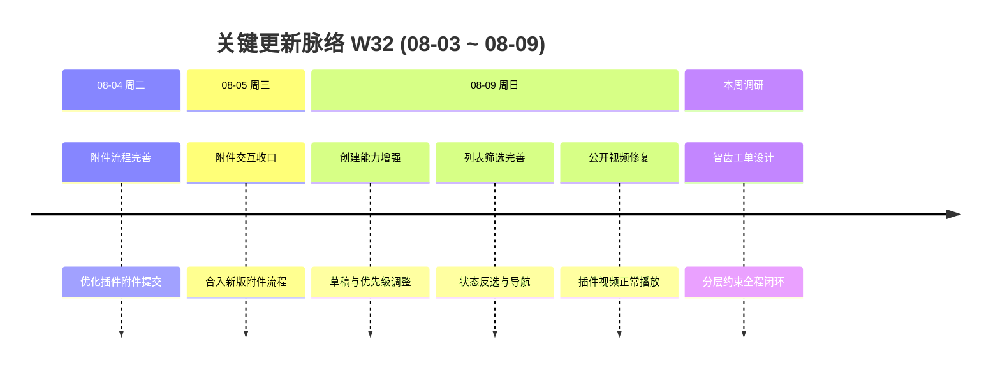

# 周报 2026-W32 (2026-08-03 ~ 2026-08-09)

> **总计 21 次提交 | 15 个文件变更 | +1,895 行 / -159 行 | 20 个 PR 合入 (#274 ~ #294，#287 未出现在 Git 历史中)**
>
> **贡献者**：chenjiaying-miduo (21 commits)

**本周趋势**：本周围绕**插件附件全链路、工单创建与列表效率、工单体系化设计调研**三条主线推进。一方面持续打磨插件提单、附件补充、公开详情视频播放等体验；另一方面补齐草稿、优先级调整、状态筛选和列表导航能力。同时调研智齿科技由字段规范、智能规则、预设流程、双重时效到复盘优化的闭环工单设计，为后续分类路由、流程编排和 SLA 治理提供了更完整的参考框架。

---

## 关键更新脉络

---

## 一、已合并 Pull Requests (#274 ~ #294)

| PR | 标题 | 分类 |
|----|------|------|
| #274 | 回退插件提单弹窗布局调整 | 🐛 Bug 修复 |
| #275 | 重新设计插件提单弹窗 | ✨ 新功能 |
| #276 | 压缩插件提单弹窗布局 | 🐛 Bug 修复 |
| #277 | 支持粘贴图片与视频附件 | ✨ 新功能 |
| #278 | 加固插件工单详情渲染 | 🐛 Bug 修复 |
| #279 | 规范工单详情事件作用域格式 | 🎨 UI/UX |
| #280 | 生产构建保留 SDK 标识符 | 🐛 Bug 修复 |
| #281 | 新增 2026-W31 周报 | 📝 文档 |
| #282 | 补全 2026-W31 周报 | 📝 文档 |
| #283 | Bug 简报待办纳入临时解决工单 | 🐛 Bug 修复 |
| #284 | 恢复紧凑版插件提单弹窗 | 🐛 Bug 修复 |
| #285 | 支持附件拖拽、粘贴与预览 | ✨ 新功能 |
| #286 | 完善插件附件工作流 | 🐛 Bug 修复 |
| #288 | 公开工单支持播放插件视频 | 🐛 Bug 修复 |
| #289 | 统一补充附件交互体验 | 🐛 Bug 修复 |
| #290 | 居中附件上传区域内容 | 🐛 Bug 修复 |
| #291 | 增加工单列表导航提示 | 🐛 Bug 修复 |
| #292 | 支持更新工单优先级 | ✨ 新功能 |
| #293 | 支持暂存工单创建草稿 | ✨ 新功能 |
| #294 | 完善工单状态筛选与反选 | 🐛 Bug 修复 |

> PR 编号范围按上周最后一个 PR #273 之后连续统计；#287 未出现在当前 Git 合并历史中，因此实际合入 20 个 PR。#274 ~ #281 于 08-02 合入，但依照跨周连续 PR 口径纳入本期。

---

## 二、本周完成

### 1. 插件附件工作流全面升级 — 从选择上传扩展到拖拽、粘贴、预览和补充附件

> **价值**：用户可以用更符合日常操作习惯的方式提交问题材料，并在发送前确认内容，减少遗漏、误传和后续补充沟通。

- #277、#285：支持粘贴图片与视频，以及附件拖拽、粘贴和预览，扩展插件提单的素材采集方式
- #286：继续收口附件提交状态与交互流程，让附件和工单信息更稳定地一起提交
- #289：统一工单提交后补充附件的操作体验，降低前后两段附件操作的认知差异
- #290：调整上传区域内容对齐，让拖拽与上传入口更清晰

### 2. 智齿科技工单设计调研 — 建立“由底到顶、层层约束、全程闭环”的参考模型

> **价值**：为工单平台从单点功能迭代走向规则化、流程化和可度量治理提供参考，减少依赖人工经验带来的不一致与失控。

调研总结为五层递进设计：

| 层级 | 核心机制 | 解决的问题 |
|------|----------|------------|
| 1. 规范底座 | 字段、模板、分类统一填写格式与业务类型 | 保证问题记录完整、规范、可统计 |
| 2. 智能处理 | 规则自动分派、调整优先级、触发提醒 | 减少简单工单的人工判断和重复操作 |
| 3. 协同流程 | 复杂工单使用预设流程固定步骤并自动流转 | 让跨部门协作责任到人、过程可追踪 |
| 4. 双重时效 | 对外约束客户响应，对内监控岗位处理速度 | 同时守住服务承诺与内部执行效率 |
| 5. 闭环优化 | 串联提报、分配、处理、监督和复盘 | 用处理结果持续优化规则与流程 |

这一模型与上周形成的「产品归属 × 问题类型 × 紧急程度 × 问题来源」分类路由思路可以衔接：先用字段、模板和分类建立规范底座，再用规则处理简单工单；对复杂工单进入预设流程，并用内外两套时效指标贯穿监督，最终通过复盘反哺分类、规则与流程配置。

### 3. 工单创建与优先级能力增强 — 支持草稿暂存和处理顺序动态调整

> **价值**：用户填写复杂工单时不再担心中途丢失内容，处理团队也能根据影响变化及时调整处置顺序。

- #293：增加工单创建草稿能力，支持暂存尚未提交的标题、描述及相关填写状态，降低重复录入风险
- #292：补充优先级更新接口和前端交互，使工单创建后仍可根据实际影响调整优先级
- 前后端同步扩展类型、接口、应用服务与持久化逻辑，保证操作完整落库

### 4. 插件视频与详情展示修复 — 打通上传到公开查看的展示链路

> **价值**：问题提交人和处理人可以直接通过视频复现问题，不必下载文件或反复询问现象。

- #278：加固插件工单详情渲染，降低不同内容形态导致的页面异常
- #288：修复公开工单页面的视频识别与播放，让插件上传的视频能够正常查看
- 统一问题截图与附件地址处理，为图片、视频在不同详情场景中的展示提供一致基础

### 5. 插件提单弹窗体验迭代 — 在多轮设计、回退和修正后恢复紧凑布局

> **价值**：插件用户可以在有限的宿主页面空间内更高效地填写信息，同时保持字段清晰、操作集中。

- #274 ~ #276：经历布局回退、重新设计和紧凑化调整，持续验证弹窗的信息密度与操作路径
- #284：恢复紧凑版提单弹窗，收口前序调整后的最终体验
- #279：整理详情事件作用域格式，提升相关代码的一致性和可维护性

### 6. 工单列表筛选与导航增强 — 更快定位目标工单

> **价值**：用户可以更灵活地组合或排除状态，并通过清晰入口返回列表，减少查找和页面切换成本。

- #294：补齐工单状态筛选，并支持反选，适合快速排除不关注的状态集合
- #291：增加列表导航提示，使用户从详情或其他页面返回工单列表的路径更明确

### 7. Bug 简报与生产构建修正 — 补齐待办口径并保障 SDK 可识别

> **价值**：管理者看到的待处理范围更准确，生产环境中的插件能力也更稳定。

- #283：将“临时解决”工单纳入 Bug 简报待处理范围，避免尚未正式关闭的事项被遗漏
- #280：在生产压缩构建中保留 SDK 标识符，降低插件识别或调用异常风险

### 8. W31 周报归档与补全

> **价值**：连续保存交付与调研记录，为本期对比、后续复盘和方向验证提供可追溯基线。

- #281、#282：新增并补全 W31 周报，记录分类路由调研、SLA 展示、分类菜单和插件提单升级等成果

---

## 三、本周数据

### 每日提交分布

| 日期 | 提交数 | 重点方向 |
|------|--------|----------|
| 08-04 (周二) | 2 | 完善插件附件工作流并同步主分支 |
| 08-05 (周三) | 1 | 合入插件附件工作流修复 (#286) |
| 08-09 (周日) | 18 | 视频播放、补充附件、列表导航、优先级、草稿与状态筛选 (#288 ~ #294) |
| 08-03、08-06 ~ 08-08 | 0 | 智齿工单体系调研，无代码提交 |

> 本周日期窗口内的 21 次提交用于提交量、文件和行数统计；PR 范围则按上周最后一个 PR #273 之后连续统计，因此包含日期边界前合入的 #274 ~ #285。

### PR 类型分布

> 以下按实际合入的 20 个 PR 的主要功能提交归类，不重复计算分支合并记录。

| 类型 | 数量 | 占比 |
|------|------|------|
| feat (新功能) | 5 | 25% |
| fix (Bug 修复) | 12 | 60% |
| docs (文档) | 2 | 10% |
| style/UI (规范与体验) | 1 | 5% |

---

## 四、与上周 (W31) 对比

| 指标 | W31 | W32 | 变化 |
|------|-----|-----|------|
| 提交数 | 12 | 21 | +75% |
| 合入 PR 数 | 6 | 20 | +14 |
| 文件变更 | 11 | 15 | +36% |
| 净增行数 | +254 | +1,736 | +583% |

> W32 研发活跃度明显回升，工作重点从 SLA 展示和分类菜单扩展到插件附件全链路、工单创建效率与列表操作；同时，智齿工单设计调研进一步补全了上周分类路由方案之上的规则、流程、时效与复盘闭环。

### 上周方向落地情况

| W31 建议方向 | W32 实际进展 |
|--------------|--------------|
| P0 分类标签字典定稿 | ⚠️ 未见字典定稿记录；智齿调研进一步确认字段、模板和分类应作为体系底座 |
| P0 路由决策表原型 | ⚠️ 尚未形成决策表原型；已明确简单工单可由规则自动分派、调优先级和提醒 |
| P1 插件结构化提单验收 | ✅ 持续完善图片/视频附件、拖拽粘贴预览、弹窗布局和生产 SDK 构建 |
| P1 SLA 时间展示回归 | ⚠️ 本周未见 SLA 专项回归提交；调研补充了对外响应与内部岗位处理的双重时效视角 |
| P2 分类路由小范围试点 | ⚠️ 未见试点记录，仍处于方案与外部产品调研阶段 |

---

## 五、下周优先级建议

| 优先级 | 方向 | 建议动作 |
|--------|------|----------|
| P0 | 工单规范底座原型 | 将智齿调研映射到现有系统，产出首版字段、模板、分类字典及必填校验清单，明确各项维护责任人 |
| P0 | 路由规则最小闭环 | 选取一类高频简单工单，配置“分类组合 → 处理组、优先级、提醒、SLA”的决策表，并保留人工确认与兜底入口 |
| P1 | 复杂流程样板 | 选择一个跨客服、产品、研发的典型场景，定义固定节点、节点责任人、进入/退出条件和异常退回机制 |
| P1 | 双重时效指标设计 | 区分客户可见的首响/解决承诺与内部各岗位处理时长，明确暂停、转派、升级和超时口径 |
| P1 | 插件附件端到端验收 | 覆盖选择、拖拽、粘贴、预览、提交、补充附件及公开视频播放，并验证大文件、失败重试和生产构建 |
| P2 | 草稿与筛选体验回归 | 验证草稿恢复、提交后清理、优先级修改权限及状态正选/反选边界，补齐关键自动化测试 |
| P2 | 复盘数据闭环 | 设计路由命中率、转派率、节点耗时、超时率和重复问题率，为后续规则与流程优化建立基线 |
