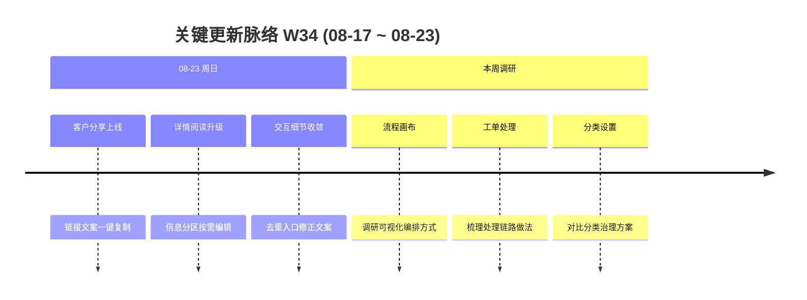

# 周报 2026-W34 (2026-08-17 ~ 2026-08-23)

> **总计 12 次提交 | 1 个文件变更 | +967 行 / -325 行 | 5 个 PR 合入 (#307 ~ #311)**
>
> **贡献者**：chenjiaying-miduo (12 commits)

**本周趋势**：本周围绕**工单详情使用体验**集中推进，一方面上线面向客户的工单分享能力并持续收敛入口交互，另一方面重构缺陷工单详情的阅读与分区编辑方式。同时调研流程画布、工单处理和分类设置的行业做法，为后续工作流配置、处理链路和分类治理方案设计建立参考基线。

---

## 关键更新脉络

---

## 一、已合并 Pull Requests (#307 ~ #311)

| PR | 标题 | 分类 |
|----|------|------|
| #307 | 新增客户工单分享弹窗 | ✨ 新功能 |
| #308 | 强化客户分享入口展示 | 🎨 UI/UX |
| #309 | 移除重复的工单分享入口 | 🐛 Bug 修复 |
| #310 | 升级工单详情阅读体验 | 🔄 更新 |
| #311 | 避免工作流确认按钮文案重复 | 🐛 Bug 修复 |

> W33 周报不存在，本期 PR 范围按日期窗口内的合并记录确定为 #307 ~ #311。

---

## 二、本周完成

### 1. 工单详情阅读体验升级 — 从持续编辑转向清晰阅读

> **价值**：处理人员可以先快速读懂客户、测试和开发信息，只在需要修改时进入对应区块编辑，减少复杂表单带来的阅读干扰和误操作。

- #310 重构缺陷工单详情的信息组织方式，默认以阅读态呈现，按客服、测试、开发区块独立进入编辑
- 为复现环境、影响范围和严重程度补充中文展示标签，让关键信息更直观
- 增加编辑快照与取消恢复机制，取消编辑时还原字段和问题截图，避免未保存修改残留
- 保存成功后自动退出编辑态并刷新详情，使阅读、编辑和结果反馈形成完整闭环
- 重新梳理详情页的信息层次、间距和响应式样式，改善长工单与移动端的阅读体验

### 2. 客户工单分享能力 — 标准化对外进度同步

> **价值**：客服或处理人员可以快速把工单进度入口发送给客户，客户无需登录即可查看，减少人工整理文案和反复询问处理状态。

- #307 新增“分享给客户”弹窗，根据工单编号生成公开访问链接
- 自动组合工单编号、标题、当前状态和公开链接，形成可直接发送的标准分享文案
- 支持分别复制公开链接、复制完整文案，以及打开客户视角进行分享前预览
- 增加敏感信息检查提示，提醒分享前确认工单不包含密码、密钥、内部账号或客户隐私
- #308 将入口提升至标题区域并强化视觉层级，移动端改为整行按钮，提升发现效率
- #309 移除迭代过程中产生的重复入口，保证客户分享操作位置唯一、认知一致

### 3. 工作流确认文案修正 — 避免动作名称重复

> **价值**：处理人员看到的确认按钮表达更自然、准确，减少执行关键流程动作时的理解疑惑。

- #311 根据动作名称动态生成确认文案
- 动作本身已以“确认”开头时直接使用原名称，否则自动补充“确认”前缀
- 修复“确认确认解决”等重复标签，同时保留普通动作原有的确认语义

### 4. 流程画布、工单处理与分类设置调研 — 为下一阶段方案设计建立参考

> **价值**：在进入开发前先对比成熟做法，有助于减少流程配置、处理操作和分类体系上的返工，形成更贴合实际协作方式的产品方案。

- **流程画布**：调研可视化节点编排、节点连接、条件分支、配置面板及画布操作等常见交互方式
- **工单处理**：梳理受理、分派、流转、退回、关闭等处理动作的组织方式，以及状态、动作和处理记录之间的关系
- **分类设置**：对比分类层级、启停管理、适用范围及分类与流程关联等设置思路
- 本周以方案调研和模式对比为主，尚未形成代码提交；后续需结合内部角色、缺陷流程和分类路由目标沉淀可评审原型

---

## 三、本周数据

### 每日提交分布

| 日期 | 提交数 | 重点方向 |
|------|--------|----------|
| 08-23 (周日) | 12 | 客户工单分享、详情阅读体验升级、交互细节修正 (#307 ~ #311) |
| 08-17 ~ 08-22 | 0 | 流程画布、工单处理与分类设置方案调研，无代码提交 |

### 提交类型分布

> 以下按 5 个 PR 的主要功能提交归类，不重复计算 PR 合并及分支同步记录。

| 类型 | 数量 | 占比 |
|------|------|------|
| feat (新功能) | 2 | 40% |
| fix (Bug 修复) | 3 | 60% |

---

## 四、上周基线说明

仓库中没有 `doc/report.2026-W33.md`，因此本期不使用更早周报替代上周数据，也不生成可能误导的环比指标和“上周方向落地情况”。待周报恢复连续记录后，再继续进行周度趋势对比。

---

## 五、下周优先级建议

| 优先级 | 方向 | 建议动作 |
|--------|------|----------|
| P0 | 三项调研结论沉淀 | 将流程画布、工单处理、分类设置的竞品做法整理为对比表，明确适用场景、取舍与内部约束 |
| P0 | 核心链路原型串联 | 用低保真原型串联“分类选择 → 流程匹配 → 画布配置 → 工单处理”，验证三块能力的信息关系 |
| P1 | 工单详情回归 | 覆盖客服、测试、开发区块的编辑、取消、保存、截图恢复和移动端展示，确认阅读态重构未影响原有处理流程 |
| P1 | 客户分享验收 | 在真实环境验证公开链接、复制权限、客户视角和敏感信息提示，并确认不同部署路径下链接生成正确 |
| P2 | 配置模型边界 | 明确分类、工作流、状态、节点和处理动作之间的归属关系，形成首版数据模型及配置权限清单 |
