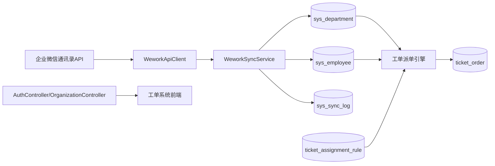
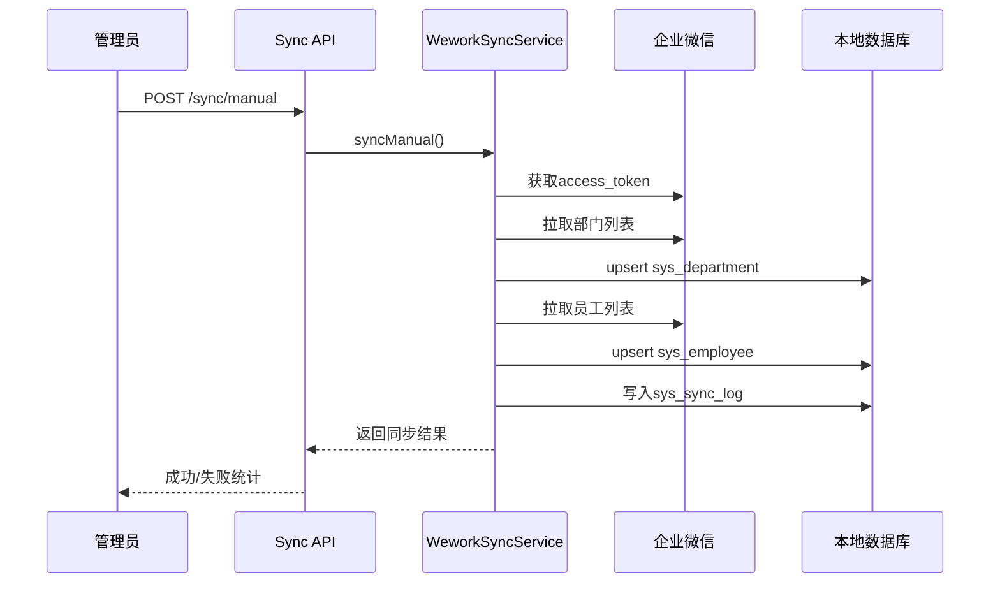

# 工单系统-企业微信账号体系复用实施清单

## 1. 文档目的

本清单用于指导工单系统复用企业微信账号体系，形成可直接实施的产品方案与技术方案，覆盖范围包括：

- 组织架构同步（部门、员工）
- 企微扫码登录与会话管理
- 工单权限与组织联动
- 自动派单规则联动
- 上线验收与运维保障

适用场景：内部工单系统，不做多租户隔离，目标是快速落地并稳定运行。

---

## 2. 业务目标与原则

## 2.1 核心目标

- 账号统一：以企业微信账号作为工单系统身份源。
- 组织统一：以企业微信部门架构作为组织源，工单系统只维护副本。
- 权限统一：基于企微身份 + 本地RBAC角色进行授权。
- 运维可控：同步过程可监控、可重试、可审计。

## 2.2 设计原则

- 主数据唯一：组织与员工主数据在企业微信。
- 本地可查询：工单系统本地持久化副本，保障查询性能。
- 权责分离：认证归企微，业务授权归工单系统。
- 幂等优先：重复同步不产生脏数据。

---

## 3. 功能范围（一期）

## 3.1 包含范围

1. 企业微信连接配置（corpId、agentId、corpSecret）
2. 手动同步与定时同步（部门、员工）
3. 部门树、员工列表、员工详情查询
4. 企微扫码登录（可扩展短信登录）
5. 工单自动派单（按部门/角色/规则）
6. 同步状态与日志查询

## 3.2 不包含范围

1. 工单系统内直接增删改部门/员工
2. 多租户组织隔离
3. 跨企业通讯录聚合
4. 复杂审批流改造

---

## 4. 角色与权限模型

## 4.1 系统角色建议

- 系统管理员：配置企微连接、触发同步、查看日志、维护规则。
- 工单管理员：维护工单分类、派单规则、查看组织与人员。
- 部门主管：查看本部门工单并处理升级工单。
- 处理人：接单、处理、关闭工单。
- 提交人：提交并跟踪工单。

## 4.2 权限策略

- 账号身份：取自企微用户（`wework_userid`）。
- 业务权限：本地角色表维护（不可完全依赖企微字段）。
- 离职失效：员工状态非在职时，禁止登录或操作敏感功能。

---

## 5. 总体架构



---

## 6. 数据模型设计

以下为建议最小模型（可沿用当前项目已有结构）。

## 6.1 复用表

1. `sys_department`
   - 关键字段：`wework_dept_id`（唯一）、`dept_name`、`parent_id`、`dept_status`、`sync_status`、`sync_time`
2. `sys_employee`
   - 关键字段：`wework_userid`（唯一）、`emp_name`、`mobile`、`dept_id`、`emp_status`、`sync_status`、`sync_time`
3. `sys_wework_config`
   - 关键字段：`corp_id`、`agent_id`、`corp_secret`（密文）、`sync_interval_type`、`sync_time`
4. `sys_sync_log`
   - 关键字段：`sync_type`、`sync_mode`、`sync_status`、`total_count`、`success_count`、`fail_count`、`error_message`

## 6.2 工单侧新增表

1. `ticket_user_role`
   - 字段：`id`、`wework_userid`、`role_code`、`status`、`create_time`...
2. `ticket_assignment_rule`
   - 字段：`id`、`ticket_category`、`priority`、`target_dept_id`、`default_assignee_wework_userid`、`status`、`sort_order`...

## 6.3 工单主表关联建议

- `ticket_order.creator_wework_userid`
- `ticket_order.assignee_wework_userid`
- `ticket_order.current_dept_id`

说明：优先用`wework_userid`做跨系统稳定关联，避免仅依赖本地自增ID。

---

## 7. 字段映射规范（企微 -> 工单系统）

## 7.1 部门映射

| 企微字段 | 工单系统字段 | 说明 |
|---|---|---|
| id | wework_dept_id | 部门唯一外部键 |
| name | dept_name | 部门名称 |
| parentid | parent_id | 父部门企微ID |
| order | dept_order | 展示排序 |
| department_leader | leader_userid | 部门负责人企微ID |

## 7.2 员工映射

| 企微字段 | 工单系统字段 | 说明 |
|---|---|---|
| userid | wework_userid | 员工唯一外部键 |
| name | emp_name | 姓名 |
| mobile | mobile | 手机号 |
| email | email | 邮箱 |
| position | position | 职位 |
| department[0] | wework_dept_id/dept_id | 主部门 |
| is_leader_in_dept | is_dept_leader | 是否部门负责人 |
| status | emp_status | 1在职/2停用/4未激活/5退出 |

状态映射建议：

- `1 -> 在职`
- `2 -> 停用`
- `4 -> 离职`
- `5 -> 离职`

---

## 8. 核心接口契约（建议）

## 8.1 认证接口

1. `GET /api/auth/qrcode`
   - 功能：获取企微登录二维码
2. `POST /api/auth/callback`
   - 功能：处理企微授权回调
3. `GET /api/auth/status/{state}`
   - 功能：轮询扫码状态
4. `POST /api/auth/logout`
   - 功能：注销登录

## 8.2 组织同步接口

1. `POST /api/v1/sync/manual`
   - 功能：手动触发同步
2. `GET /api/v1/sync/status`
   - 功能：查询最近同步状态
3. `GET /api/v1/departments/tree`
   - 功能：部门树
4. `GET /api/v1/employees/page`
   - 功能：员工分页查询

## 8.3 工单联动接口

1. `GET /api/ticket/assignee/suggest`
   - 入参：`category`、`priority`、`deptId`
   - 出参：推荐处理人列表
2. `POST /api/ticket/assign/auto`
   - 功能：根据规则自动分配处理人
3. `POST /api/ticket/assign/escalate`
   - 功能：超时升级到主管

---

## 9. 同步流程设计

## 9.1 手动同步时序



## 9.2 定时同步策略

- 默认建议：每天凌晨2点（可配置）。
- 仅在`scheduleEnabled=true`时执行。
- 与白天业务高峰错峰，避免影响工单查询。

---

## 10. 安全与合规要求

1. `corp_secret`必须密文存储，不可明文入库或入仓库。
2. 日志脱敏：手机号、邮箱、token不可全量打印。
3. 权限隔离：同步配置与手动同步仅管理员可操作。
4. 接口防刷：登录状态轮询接口需限流。
5. JWT密钥独立托管，不写死在代码仓库。

---

## 11. 配置模板（可直接复用）

```yaml
wework:
  config:
    corpId: ${WEWORK_CORP_ID}
    agentId: ${WEWORK_AGENT_ID}
    corpSecret: ${WEWORK_CORP_SECRET}
    apiBaseUrl: https://qyapi.weixin.qq.com
    connectTimeout: 10000
    readTimeout: 30000
    sync:
      scheduleEnabled: true
      scheduleCron: "0 0 2 * * ?"
      batchSize: 100
      retryCount: 3
    jwt:
      secret: ${WEWORK_JWT_SECRET}
      expireHours: 24
      refreshExpireDays: 7
```

---

## 12. 实施排期（建议10个工作日）

## Task001：数据与实体（1天）

- 建表（组织、员工、配置、日志、工单角色、派单规则）
- 实体、Mapper、索引完成

## Task002：企微API与配置（1.5天）

- API客户端封装
- 配置中心接入
- token缓存

## Task003：同步引擎（2天）

- 部门同步、员工同步
- 手动触发、结果汇总
- 同步日志写入

## Task004：组织查询API（1天）

- 部门树、员工分页、员工详情
- 状态字段转换与脱敏

## Task005：登录与会话（1.5天）

- 企微扫码登录
- JWT发放与会话管理

## Task006：工单联动（2天）

- 自动派单规则
- 升级规则
- 角色权限联动

## Task007：联调与验收（1天）

- 用真实企微数据联调
- 修复缺陷并出验收报告

---

## 13. 风险清单与应对

1. API限频风险
   - 应对：批量拉取、token缓存、失败重试、指数退避
2. 同步遗漏风险
   - 应对：固定“部门先、员工后”，并提供手动全量补偿
3. 权限穿透风险
   - 应对：认证和授权分离，后台接口做角色拦截
4. 离职残留权限风险
   - 应对：同步后即时刷新用户状态并失效会话
5. 配置泄露风险
   - 应对：密钥托管+配置加密+最小可见权限

---

## 14. 验收标准

1. 在企微新增员工，下一次同步后可在工单系统查询到。
2. 在企微将员工设为离职/停用后，该用户无法继续处理工单。
3. 管理员手动同步可返回成功/失败数量与错误原因。
4. 工单可按分类和部门规则自动分配处理人。
5. 全链路日志可追踪（同步触发、执行、结果）。

---

## 15. 交付物清单

1. 表结构SQL脚本
2. 后端接口文档（OpenAPI/Swagger）
3. 前端页面（组织、同步、配置、日志）
4. 同步与登录联调报告
5. 上线与回滚说明

---

## 16. 后续扩展（第二期建议）

1. 同步日志可视化看板（成功率、耗时、失败原因分布）
2. 企业微信消息通知（新工单、超时催办、升级提醒）
3. 多系统SSO联动（工单系统与其他内网系统互信）
4. 组织变更事件驱动（由定时拉取升级为准实时）

