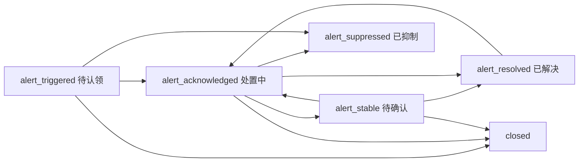

# 告警工单流转 — 工作流设计

## 版本信息

| 版本 | 日期 | 变更内容 |
|------|------|----------|
| v1.0 | 2026-04-02 | 初版：工作流命名「告警工单流转」；恢复事件采用方案 A |
| v1.1 | 2026-04-02 | **OnCall 专用状态机**：与通用工单分离；对齐 PagerDuty incident / FlashDuty 分诊语义；Flyway `V43__alert_workflow_oncall_states.sql` 更新 id=4 |

---

## 一、背景与目标

运维告警经夜莺 Webhook 接入后，通过 `TicketApplicationService.createTicket` 创建工单，`source = ALERT`。工单**首状态与后续流转**由**分类绑定的 `workflow_id`** 决定。

**目标：**

- 告警类工单使用**独立状态码**（**不与**通用工单 `pending_assign` / `processing` 混用），命名与环节贴近 **PagerDuty**（Incident：Triggered → Acknowledged → Resolved）与 **FlashDuty**（分诊、认领、处置、结单）等 OnCall 产品。
- 仍复用现有 **FSM 引擎**（`transit` / `available-actions` / `ticket_flow_record`），仅 JSON 定义不同。
- **恢复事件**固定为**方案 A**：不自动 transition，仅系统评论（见第三节）。

**非目标：**

- 不在本版实现「多轮值班升级链」「短信/电话自动外呼」等通道编排（可作为后续增强）。
- 不改变夜莺去重、notify 用户匹配、自动分派策略（见《告警接入工单系统技术设计》）。

---

## 二、与市面 OnCall 产品的概念对齐（简要）

| 本工作流 | 近似语义（PagerDuty / 通用 OnCall） |
|----------|-------------------------------------|
| `alert_triggered` 待认领 | Open / Triggered，未 Ack |
| `alert_acknowledged` 处置中 | Acknowledged，正在处理 |
| `alert_stable` 待确认 | 指标已恢复或风险已控，待人工作**结单确认**（不等同 Resolved） |
| `alert_resolved` 已解决 | Resolved，可进入复盘 |
| `alert_suppressed` 已抑制 | Suppressed / Silenced，降噪或维护窗口 |
| `closed` 已关闭 | 与平台统一「关闭」按钮兼容的终态 |

---

## 三、工作流定义摘要

| 项 | 说明 |
|----|------|
| 工作流名称 | **告警工单流转** |
| 模式 | SIMPLE |
| 数据库主键 | **`workflow.id = 4`**（`V42` 插入，`V43` 更新 states/transitions） |

### 3.1 状态节点

| code | 名称 | 类型 | SLA 语义 |
|------|------|--------|----------|
| `alert_triggered` | 待认领 | INITIAL | START_RESPONSE |
| `alert_acknowledged` | 处置中 | INTERMEDIATE | START_RESOLVE |
| `alert_stable` | 待确认 | INTERMEDIATE | PAUSE |
| `alert_resolved` | 已解决 | TERMINAL | STOP |
| `alert_suppressed` | 已抑制 | TERMINAL | STOP |
| `closed` | 已关闭 | TERMINAL | STOP |

### 3.2 主路径（推荐）

**流转名称与权限**以库表 `workflow.transitions`（`V43`）为准；典型动作包括：**认领 / 分派认领**、**标记稳定**、**确认解决**、**抑制**、**关闭**、**重新打开 / 重新激活**。

### 3.3 与自动分派、分派接口的衔接（实现约定）

- **待认领池**等价于通用工单的「待分派池」：`alert_triggered` 且 `workflow_id=4` 时，**自动分派**与 **`assignFromPendingDispatch`** 与 `pending_assign` 同样处理（见 `DispatchAppService` / `TicketWorkflowAppService`）。
- **认领**：`alert_triggered` → `alert_acknowledged` 的 transition 带 `allowTransfer`；自动分派或人工分派时写入处理人；用户点击「认领」走 `assignTicket` + 工作流流转。

---

## 四、恢复事件（方案 A）

| 策略 | 内容 |
|------|------|
| 正式方案 | **方案 A** |
| 行为 | 夜莺 `is_recovered=true` 时：若关联工单存在且按 **`WorkflowApplicationService.isTerminalStatus(workflowId, status)`** 判断**非终态**，仅写入**系统评论**，**不** `transit` |
| 产品含义 | 监控恢复 ≠ 结单；稳定后通常停留在 `alert_stable` 或仍在 `alert_acknowledged`，由人确认 **确认解决** 或 **关闭** |
| 实现 | `AlertTicketApplicationService.handleRecoveredEvent` |

---

## 五、配置与验收

1. 分类绑定 **`workflow_id = 4`**（告警工单流转）。
2. 映射告警规则到该分类；配置 SLA、分派规则。

**验收要点：**

- [ ] 新告警工单首状态为 `alert_triggered`。
- [ ] 自动分派后进入 `alert_acknowledged` 且处理人正确。
- [ ] 恢复事件仅评论，状态不变（非终态）。
- [ ] 列表/详情/看板展示告警状态中文标签正确。

---

## 六、回滚与兼容

- **回滚工作流定义**：可将 id=4 的 JSON 改回历史版本（不推荐与已产线数据混用）；或将分类改绑通用工作流 id=1。
- **已处于旧版 id=4 状态码**（若曾部署 v1.0 与通用一致的 id=4）的工单：需数据迁移或手工订正状态，本脚本 `V43` 假定新环境或接受一次性更新 id=4 定义。

---

## 七、关联文档

- [告警接入工单系统技术设计.md](./告警接入工单系统技术设计.md)
- [工单系统/task005-工作流引擎与分派.md](./工单系统/task005-工作流引擎与分派.md)
