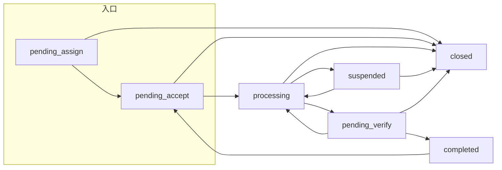

# 告警工单流转 — 工作流设计

## 版本信息

| 版本 | 日期 | 变更内容 |
|------|------|----------|
| v1.0 | 2026-04-02 | 初版：工作流命名「告警工单流转」；恢复事件采用方案 A（仅评论、不自动改状态） |

---

## 一、背景与目标

运维告警经夜莺 Webhook 接入后，通过 `TicketApplicationService.createTicket` 创建工单，`source = ALERT`。工单**首状态与后续流转**完全由**分类绑定的 `workflow_id`** 决定。

**目标：**

- 为告警类工单提供**独立可识别**的工作流定义（名称：**告警工单流转**），与「通用工单工作流」解耦配置，便于按分类绑定、单独演进。
- **状态机语义**与通用工单保持一致，降低引擎与前端适配成本。
- **恢复事件**固定为**方案 A**：不自动关闭或推进状态，仅追加系统评论（与 `AlertTicketApplicationService` 实现一致）。

**非目标：**

- 不为告警单独增加「监控已恢复」类自动 transition（方案 B 不在本版范围）。
- 不改变夜莺去重、处理人匹配、自动分派等接入逻辑（见《告警接入工单系统技术设计》）。

---

## 二、工作流定义摘要

| 项 | 说明 |
|----|------|
| 工作流名称 | **告警工单流转** |
| 模式 | SIMPLE |
| 数据库主键 | 内置记录 **`workflow.id = 4`**（由迁移脚本 `V42__alert_ticket_workflow.sql` 写入；新环境首次执行后固定为该 ID） |
| 与通用工单关系 | **states / transitions 与「通用工单工作流」（id=1）当前版本对齐**；后续若需告警专用差异，可仅改 id=4 的配置 |

### 2.1 状态节点

| code | 名称 | 类型 | SLA 语义（与引擎一致） |
|------|------|------|------------------------|
| `pending_assign` | 待分派 | INITIAL | START_RESPONSE |
| `pending_accept` | 待受理 | INTERMEDIATE | START_RESPONSE |
| `processing` | 处理中 | INTERMEDIATE | START_RESOLVE |
| `suspended` | 已挂起 | INTERMEDIATE | PAUSE |
| `pending_verify` | 待验收 | INTERMEDIATE | PAUSE |
| `completed` | 已完成 | TERMINAL | STOP |
| `closed` | 已关闭 | TERMINAL | STOP |

### 2.2 主路径（推荐运维闭环）

说明：

- **建单首状态**：由工作流 JSON 中 **type=INITIAL** 的节点决定（`pending_assign`）。若创建时已带处理人，自动分派链路可能很快进入 `pending_accept`；无处理人则停留 `pending_assign` 直至分派。
- **处理中**：一线处理、止血、变更协调。
- **挂起**：等待窗口或外部依赖；SLA 是否暂停依分类绑定的 SLA 策略。
- **待验收**：需要业务/值班长确认时再走；纯运维自闭环可从 `processing` 直接「处理完成」或按组织规范「关闭」。
- **已完成 / 已关闭**：终态；**监控恢复不等于已完成**（见下文）。

流转权限、transitionId、`requireRemark` 等以数据库 `workflow.transitions` 为准（与 id=1 通用工单保持一致）。

---

## 三、恢复事件（方案 A）

| 策略 | 内容 |
|------|------|
| 正式方案 | **方案 A** |
| 行为 | 夜莺 `is_recovered=true` 时：若存在关联工单且状态**非** `completed` / `closed`，仅写入**系统评论**（类型 `system`），**不调用** `transit`，**不修改**工单状态 |
| 产品含义 | 「指标恢复」与「事故/告警处置完结」分离，避免抖动误关单 |
| 实现位置 | `AlertTicketApplicationService.handleRecoveredEvent` → `addRecoveryComment` |

若工单已处于终态，恢复事件仍记 `alert_event_log`，**不再**追加评论（与现实现一致）。

---

## 四、与告警接入的衔接

| 环节 | 说明 |
|------|------|
| 分类绑定 | 告警规则映射中的 **`category_id`** 对应分类应绑定 **`workflow_id = 4`**（告警工单流转），与人工通用工单分类区分 |
| 来源标记 | `ticket.source = ALERT`，用于报表与筛选；**不**单独走另一套状态机 |
| 去重 | 同 hash 在去重窗口内不建新单，**不改变**已有工单状态 |
| 重复触发（窗口外） | 产生新工单，重新从 INITIAL 进入本工作流 |

---

## 五、配置与验收

**配置步骤（运维/管理员）：**

1. 确认库中存在工作流 **「告警工单流转」**（内置 id=4，迁移执行后）。
2. 新建或编辑工单分类（如「监控告警」），将 **工作流** 选为 **告警工单流转**。
3. 在「告警规则映射」中把规则映射到该分类；配置 SLA、分派规则与现网一致。

**验收要点：**

- [ ] 告警创建工单后，`workflow_id` 为 4，首状态为 `pending_assign`（或随后进入 `pending_accept`，与分派结果一致）。
- [ ] 可用操作与通用工单一致（来自 `available-actions`），流转后 `ticket_flow_record` 有记录。
- [ ] 恢复事件仅增加评论，工单状态不变（非终态场景下验证）。

---

## 六、回滚与兼容

- **回滚**：可将告警分类的 `workflow_id` 改回 `1`（通用工单工作流）；不建议删除 `workflow` id=4 记录（可能影响历史工单展示）。
- **兼容**：历史已用 `workflow_id=1` 的告警分类工单无需迁移；新分类推荐绑定 id=4 以便配置隔离。

---

## 七、关联文档

- [告警接入工单系统技术设计.md](./告警接入工单系统技术设计.md)
- [工单系统/task005-工作流引擎与分派.md](./工单系统/task005-工作流引擎与分派.md)
